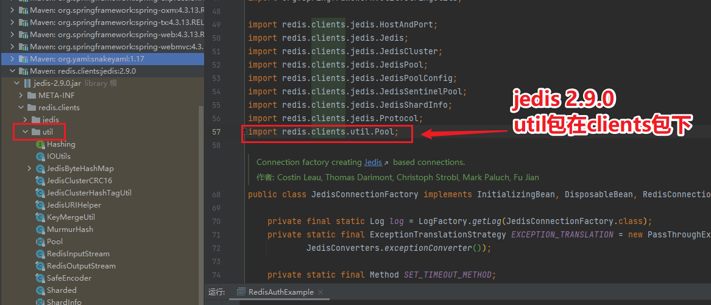
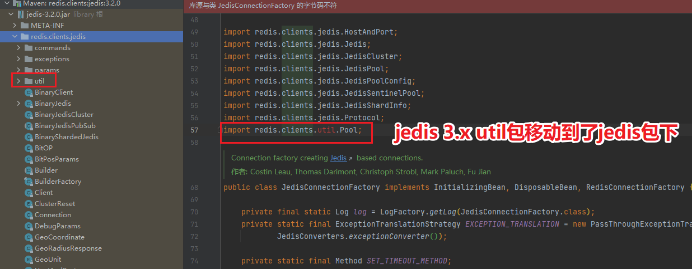
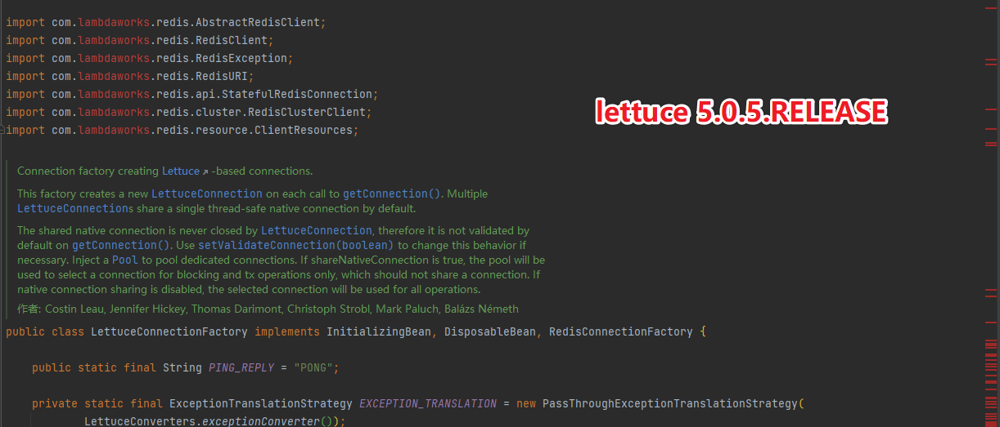
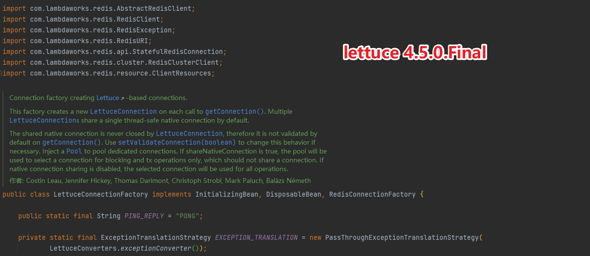
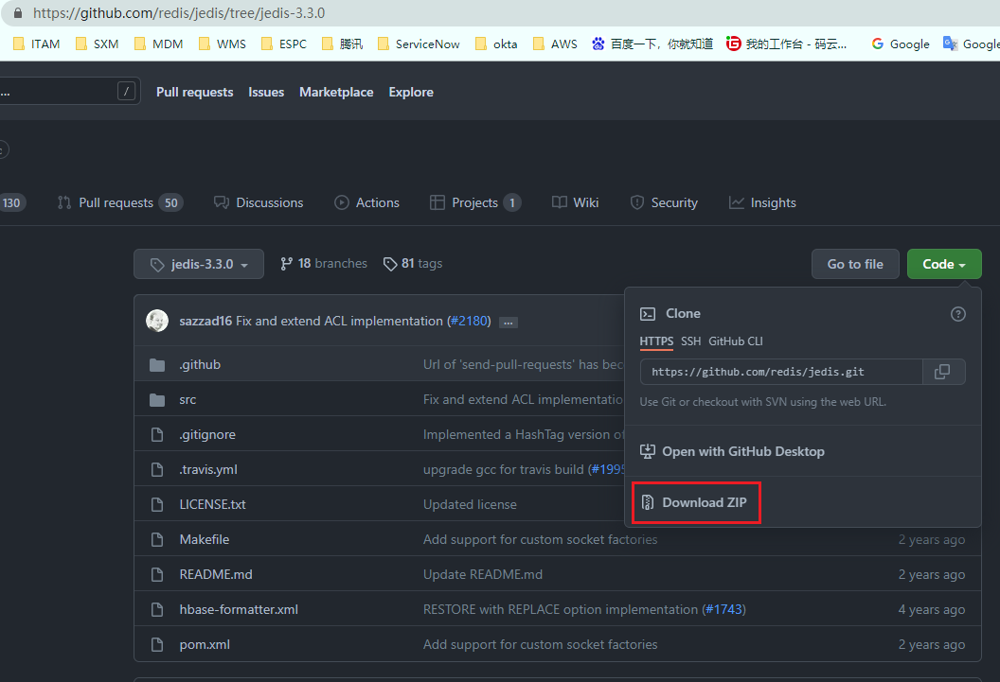
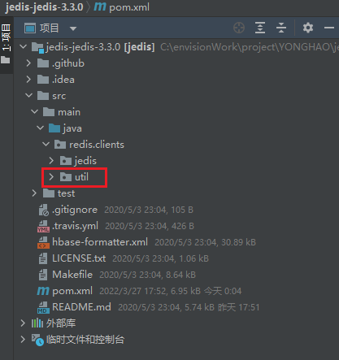
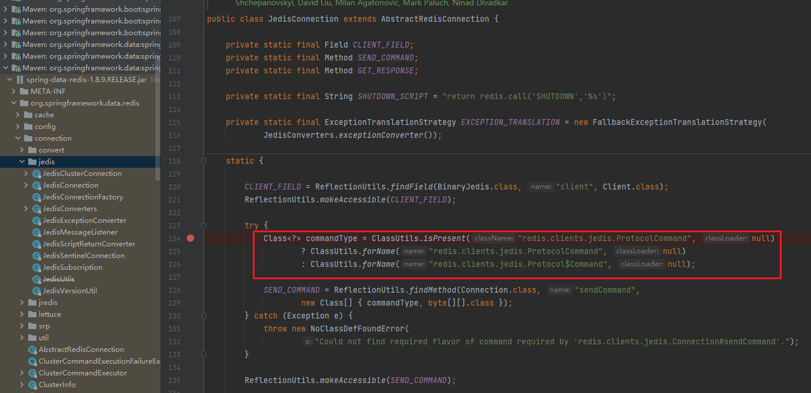
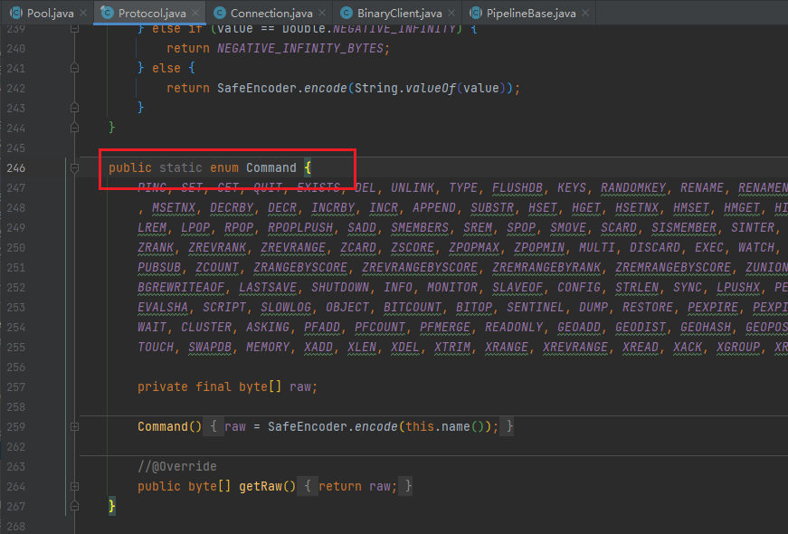

# 四合一共存版

## 本文主要以Springboot1.5.9版本为例，主要介绍如何同时使用jedis、lettuce、redisson访问自搭建redis或AWS ElastiCache，按环境加载单节点/集群客户端并支持使用密码+SSL。

> 1、使用前需要关闭Springboot对redis的自动装配。

```java
@SpringBootApplication(exclude = {
        RedisAutoConfiguration.class,
        RedisRepositoriesAutoConfiguration.class
})
public class RedisAuthExample {
    public static void main(String[] args) {
        SpringApplication.run(RedisAuthExample.class, args);
    }
}
```
</br>

> 2、取消spring-boot-starter-data-redis的依赖，更换成spring-data-redis。

```java
<!--spring-boot-starter-data-redis-->
<!--<dependency>-->
<!--  <groupId>org.springframework.boot</groupId>-->
<!--  <artifactId>spring-boot-starter-data-redis</artifactId>-->
<!--</dependency>-->

<!-- https://mvnrepository.com/artifact/org.springframework.data/spring-data-redis -->
<dependency>
    <groupId>org.springframework.data</groupId>
    <artifactId>spring-data-redis</artifactId>
</dependency>
```
</br>

> 3、application.yml配置文件（四种方式均使用该配置文件并解析至配置类）

单节点配置
```java
spring:
  redis:
    database: 0
    cluster:
      #redis客户端名称,jedis、redisson有该属性，lettuce没有
      clientName: 'redis-client-name'
      #Redis服务器访问密码
      password: 123456
      #集群模式下，逗号分隔的键值对（主机：端口）形式的服务器列表
      nodes: 127.0.0.1:6379
      #连接超时，指的是连接一个url的连接等待时间
      connectionTimeout: 1000
      #读取数据超时，指的是连接上一个url，获取response的返回等待时间
      soTimeOut: 1000
      #连接失败重试次数
      maxAttempts: 2
      #集群模式下，集群最大转发的数量
      max-redirects: 3
      #是否启用SSL连接，AWS rds服务要开启SSL才可以正常访问
      ssl: false
      #是否开启集群模式，按环境加载对应的客户端模式
      clusterEnable: false
    pool:
      max-active: 50  # 连接池最大连接数（使用负值表示没有限制）
      max-wait: -1  # 连接池最大阻塞等待时间（使用负值表示没有限制）
      max-idle: 10  # 连接池中的最大空闲连接
      min-idle: 5 # 连接池中的最小空闲连接
```
</br>

集群配置
```java
spring:
  redis:
    database: 0
    cluster:
      #redis客户端名称,jedis、redisson有该属性，lettuce没有
      clientName: 'redis-client-name'
      #Redis服务器访问密码
      password: 123456
      #集群模式下，逗号分隔的键值对（主机：端口）形式的服务器列表
      nodes: 127.0.0.1:6379,127.0.0.1:6380,127.0.0.1:6381,127.0.0.1:6382,127.0.0.1:6383,127.0.0.1:6384
      #连接超时，指的是连接一个url的连接等待时间
      connectionTimeout: 1000
      #读取数据超时，指的是连接上一个url，获取response的返回等待时间
      soTimeOut: 1000
      #连接失败重试次数
      maxAttempts: 2
      #集群模式下，集群最大转发的数量
      max-redirects: 3
      #是否启用SSL连接，AWS rds服务要开启SSL才可以正常访问
      ssl: true
      #是否开启集群模式，按环境加载对应的客户端模式
      clusterEnable: true
    pool:
      max-active: 50  # 连接池最大连接数（使用负值表示没有限制）
      max-wait: -1  # 连接池最大阻塞等待时间（使用负值表示没有限制）
      max-idle: 10  # 连接池中的最大空闲连接
      min-idle: 5 # 连接池中的最小空闲连接
```
</br>

> 4、编写redis属性配置类（四种方式均使用该配置类以及本项目中提供的配置文件）

```java
@Data
@Configuration
@ConfigurationProperties(prefix = "spring.redis")
public class RedisProperties {

    private Pool pool;

    private Cluster cluster;

    @Getter
    @Setter
    @ToString
    public static class Cluster {
        /**
         * 集群模式下，逗号分隔的键值对（主机：端口）形式的服务器列表
         */
        List<String> nodes;

        /**
         * 连接超时，指的是连接一个url的连接等待时间
         */
        Integer connectionTimeout;

        /**
         * 读取数据超时，指的是连接上一个url，获取response的返回等待时间
         */
        Integer soTimeOut;

        /**
         * 连接失败重试次数
         */
        Integer maxAttempts;

        /**
         * 集群模式下，集群最大转发的数量
         */
        Integer maxRedirects;

        /**
         * jedis客户端名称 3.x版本之后的新参数
         */
        String clientName;

        /**
         * redis访问密码
         */
        String password;

        /**
         * 是否启用SSL连接，AWS rds服务要开启SSL才可以正常访问
         */
        boolean ssl;

        /**
         * 是否开启集群模式，不用环境使用不同的模式
         */
        boolean clusterEnable;
    }

    @Getter
    @Setter
    @ToString
    public static class Pool {

        /**
         * 连接池中的最大空闲连接
         */
        Integer maxIdle;

        /**
         * 连接池中的最小空闲连接
         */
        Integer minIdle;

        /**
         * 连接池最大连接数（使用负值表示没有限制）
         */
        Integer maxActive;

        /**
         * 连接池最大阻塞等待时间（使用负值表示没有限制）
         */
        Integer maxWait;
    }
}
```
</br>
</br>

# 方式一：使用jedis（集群版需要升级jedis到3.1.0版本及以上，单节点版redis可继续使用2.9.0，本文主要以3.3.0版本为主）

### 1、在pom.xml中引入 jedis3.x (推荐3.3.0)。
```java
<dependency>
    <groupId>redis.clients</groupId>
    <artifactId>jedis</artifactId>
    <version>3.3.0</version>
</dependency>
```

### 2、新增Condition类，作用是根据配置自动加载对应的jedis客户端模式（单节点+集群）。

> 单节点标识类
```java
public class SingleConditional implements Condition {

    @Override
    public boolean matches(ConditionContext conditionContext, AnnotatedTypeMetadata annotatedTypeMetadata) {
        Environment environment = conditionContext.getEnvironment();
        return !Boolean.parseBoolean(environment.getProperty("spring.redis.cluster.clusterEnable"));
    }
}
```

</br>

> 集群标识类
```java
public class ClusterConditional implements Condition {

    @Override
    public boolean matches(ConditionContext conditionContext, AnnotatedTypeMetadata annotatedTypeMetadata) {
        Environment environment = conditionContext.getEnvironment();
        return Boolean.parseBoolean(environment.getProperty("spring.redis.cluster.clusterEnable"));
    }
}
```

### 3、手动注册jedisCluster/jedis bean，并封装jedisTemplate工具类操作redis（!!!注意这里不能直接使用JedisConnectionFactory工厂创建jedis链接，因为2.x和3.x代码有些差异，会导致JedisConnectionFactory构建失败，如果访问单节点redis服务，则可以正常使用jedis2.x版本利用JedisConnectionFactory创建链接，访问集群则不行，集群必须要使用jedis3.x）。
> jedis2.x



> jedis3.x


</br>

> JedisCluster客户端(clusterEnable设置true，则代表开启集群模式，注册JedisCluster)
```java
/**
 * 注册JedisCluster bean
 */
@Bean
@Conditional({ClusterConditional.class})
public JedisCluster jedisCluster() {
	log.info("creating jedisCluster bean");
	/**
	 * 配置连接池
	 */
	GenericObjectPoolConfig jedisPoolConfig = new GenericObjectPoolConfig();
	jedisPoolConfig.setMaxWaitMillis(redisProperties.getPool().getMaxWait());
	jedisPoolConfig.setMaxTotal(redisProperties.getPool().getMaxActive());
	jedisPoolConfig.setMaxIdle(redisProperties.getPool().getMaxIdle());
	jedisPoolConfig.setMinIdle(redisProperties.getPool().getMinIdle());

	/**
	 * 配置客户端
	 */
	Set<HostAndPort> jedisClusterNode = new HashSet<>();
	for (String node : redisProperties.getCluster().getNodes()) {
		String[] split = node.split(":");
		jedisClusterNode.add(new HostAndPort(split[0], Integer.valueOf(split[1])));
	}

	/**
	 * jedis客户端3.x版本之前不支持集群SSL链接，连接AWS redis加密资源需要开启SSL，需要换成3.x版本以上
	 * JedisCluster(
	 *      HostAndPort node,
	 *      int connectionTimeout,
	 *      int soTimeout,
	 *      int maxAttempts,
	 *      String password,
	 *      String clientName,
	 *      final GenericObjectPoolConfig poolConfig,
	 *      boolean ssl
	 *      )
	 */
	JedisCluster jedisCluster = new JedisCluster(jedisClusterNode, redisProperties.getCluster().getConnectionTimeout(), redisProperties.getCluster().getSoTimeOut(),
												 redisProperties.getCluster().getMaxAttempts(), redisProperties.getCluster().getPassword(), redisProperties.getCluster().getClientName(),
												 jedisPoolConfig, redisProperties.getCluster().isSsl());
	log.info("creating JedisCluster bean success");
	return jedisCluster;
}
```
</br>

> Jedis客户端(clusterEnable设置false，则代表关闭集群模式，注册jedis单节点客户端)
```java
/**
 * 注册Jedis bean
 * Jedis(final String host, final int port, final int timeout, final boolean ssl)
 */
@Bean
@Conditional({SingleConditional.class})
public Jedis jedis() {
	log.info("creating Single jedis bean");
	String node = redisProperties.getCluster().getNodes().get(0);
	String[] split = node.split(":");
	Jedis jedis = new Jedis(split[0], Integer.valueOf(split[1]), redisProperties.getCluster().getConnectionTimeout(), redisProperties.getCluster().isSsl());
	jedis.auth(redisProperties.getCluster().getPassword());
	log.info("creating Single jedis success");
	return jedis;
}
```
</br>

> 创建Jedis工具类、JedisClusterUtil工具类，且两个工具类均实现IJedisTemplate接口

IJedisTemplate接口
```java
public interface IJedisTemplate {

	...

    /* ------------------------------------- String 相关操作 -------------------------------------------*/

    /**
     * 用于设置给定 key 的值。如果 key 已经存储其他值， SET 就覆写旧值，且无视类型
     */
    public String set(String key, String value);

    /**
     * 用于获取指定 key 的值。如果 key 不存在，返回 nil 。如果key 储存的值不是字符串类型，返回一个错误
     */
    public String get(String key);

    /**
     * 返回所有(一个或多个)给定 key 的值。 如果给定的 key 里面，有某个 key 不存在，那么这个 key 返回特殊值 nil
     */
    public List<String> mget(String... key);

    /**
     * 用于同时设置一个或多个 key-value 对
     *
     * @param keysValues MSET key1 value1 key2 value2 .. keyN valueN
     */
    public String mset(String... keysValues);

    /**
     * 用于所有给定 key 都不存在时，同时设置一个或多个 key-value
     */
    public Long msetnx(String... keysValues);

    /**
     * 用于获取存储在指定 key 中字符串的子字符串。字符串的截取范围由 start 和 end 两个偏移量决定(包括 start 和 end 在内!)
     */
    public String getRange(String key, Long start, Long end);

    /**
     * 为指定的 key 设置值及其过期时间。如果 key 已经存在， SETEX 命令将会替换旧的值和过期时间
     *
     * @param key     指定 key
     * @param seconds 过期时间-秒
     * @param value   值
     */
    public String setex(String key, Integer seconds, String value);

    /**
     * 命令以毫秒 milliseconds 为单位设置 key 的生存时间
     */
    public String psetxx(String key, Long milliseconds, String value);

    /**
     * 在指定的 key 不存在时，为 key 设置指定的值.否则设置无效
     */
    public Long setnx(String key, String value);

    /**
     * 用指定的字符串覆盖给定 key 所储存的字符串值，覆盖的位置从偏移量 offset 开始
     */
    public Long setRange(String key, Long offset, String value);

    /**
     * 用于获取指定 key 所储存的字符串值的长度。当 key 储存的不是字符串值时，返回一个错误
     */
    public Long strlen(String key);

    /**
     * Redis Incr 命令将 key 中储存的数字值增一。
     * !:如果 key 不存在，那么 key 的值会先被初始化为 0 ，然后再执行 INCR 操作。
     * !:如果值包含错误的类型，或字符串类型的值不能表示为数字，那么返回一个错误。
     * !:本操作的值限制在 64 位(bit)有符号数字表示之内。
     */
    public Long incr(String key);

    /**
     * Redis Incr 命令将 key 中储存的数字值减一。
     * !:如果 key 不存在，那么 key 的值会先被初始化为 0 ，然后再执行 INCR 操作。
     * !:如果值包含错误的类型，或字符串类型的值不能表示为数字，那么返回一个错误。
     * !:本操作的值限制在 64 位(bit)有符号数字表示之内。
     */
    public Long decr(String key);

    /**
     * 用于为指定的 key 追加值。
     * :如果 key 已经存在并且是一个字符串， APPEND 命令将 value 追加到 key 原来的值的末尾。
     * :如果 key 不存在， APPEND 就简单地将给定 key 设为 value ，就像执行 SET key value 一样
     */
    public Object append(String key, String value);
	
	...详细请参照项目代码
}
```
</br>

JedisClusterUtil工具类(集群用)
```java
@Slf4j
@Component
@ConditionalOnBean(JedisCluster.class)
public class JedisClusterUtil implements IJedisTemplate {

    @Autowired(required = false)
    private JedisCluster jedisCluster;

	...

    /* ------------------------------------- String 相关操作 -------------------------------------------*/

    /**
     * 用于设置给定 key 的值。如果 key 已经存储其他值， SET 就覆写旧值，且无视类型
     */
    @Override
    public String set(String key, String value) {
        return jedisCluster.set(key, value);
    }

    /**
     * 用于获取指定 key 的值。如果 key 不存在，返回 nil 。如果key 储存的值不是字符串类型，返回一个错误
     */
    @Override
    public String get(String key) {
        return jedisCluster.get(key);
    }

    /**
     * 返回所有(一个或多个)给定 key 的值。 如果给定的 key 里面，有某个 key 不存在，那么这个 key 返回特殊值 nil
     */
    @Override
    public List<String> mget(String... key) {
        return jedisCluster.mget(key);
    }

    /**
     * 用于同时设置一个或多个 key-value 对
     *
     * @param keysValues MSET key1 value1 key2 value2 .. keyN valueN
     */
    @Override
    public String mset(String... keysValues) {
        return jedisCluster.mset(keysValues);
    }

    /**
     * 用于所有给定 key 都不存在时，同时设置一个或多个 key-value
     */
    @Override
    public Long msetnx(String... keysValues) {
        return jedisCluster.msetnx(keysValues);
    }

    /**
     * 用于获取存储在指定 key 中字符串的子字符串。字符串的截取范围由 start 和 end 两个偏移量决定(包括 start 和 end 在内!)
     */
    @Override
    public String getRange(String key, Long start, Long end) {
        return jedisCluster.getrange(key, start, end);
    }

    /**
     * 为指定的 key 设置值及其过期时间。如果 key 已经存在， SETEX 命令将会替换旧的值和过期时间
     *
     * @param key     指定 key
     * @param seconds 过期时间-秒
     * @param value   值
     */
    @Override
    public String setex(String key, Integer seconds, String value) {
        return jedisCluster.setex(key, seconds, value);
    }

    /**
     * 命令以毫秒 milliseconds 为单位设置 key 的生存时间
     */
    @Override
    public String psetxx(String key, Long milliseconds, String value) {
        return jedisCluster.psetex(key, milliseconds, value);
    }

    /**
     * 在指定的 key 不存在时，为 key 设置指定的值.否则设置无效
     */
    @Override
    public Long setnx(String key, String value) {
        return jedisCluster.setnx(key, value);
    }

    /**
     * 用指定的字符串覆盖给定 key 所储存的字符串值，覆盖的位置从偏移量 offset 开始
     */
    @Override
    public Long setRange(String key, Long offset, String value) {
        return jedisCluster.setrange(key, offset, value);
    }

    /**
     * 用于获取指定 key 所储存的字符串值的长度。当 key 储存的不是字符串值时，返回一个错误
     */
    @Override
    public Long strlen(String key) {
        return jedisCluster.strlen(key);
    }

    /**
     * Redis Incr 命令将 key 中储存的数字值增一。
     * !:如果 key 不存在，那么 key 的值会先被初始化为 0 ，然后再执行 INCR 操作。
     * !:如果值包含错误的类型，或字符串类型的值不能表示为数字，那么返回一个错误。
     * !:本操作的值限制在 64 位(bit)有符号数字表示之内。
     */
    @Override
    public Long incr(String key) {
        return jedisCluster.incr(key);
    }

    /**
     * Redis Incr 命令将 key 中储存的数字值减一。
     * !:如果 key 不存在，那么 key 的值会先被初始化为 0 ，然后再执行 INCR 操作。
     * !:如果值包含错误的类型，或字符串类型的值不能表示为数字，那么返回一个错误。
     * !:本操作的值限制在 64 位(bit)有符号数字表示之内。
     */
    @Override
    public Long decr(String key) {
        return jedisCluster.decr(key);
    }

    /**
     * 用于为指定的 key 追加值。
     * :如果 key 已经存在并且是一个字符串， APPEND 命令将 value 追加到 key 原来的值的末尾。
     * :如果 key 不存在， APPEND 就简单地将给定 key 设为 value ，就像执行 SET key value 一样
     */
    @Override
    public Object append(String key, String value) {
        return jedisCluster.append(key, value);
    }
	
	...详细请参照项目代码
}
```
</br>

Jedis工具类（单节点用）
```java
@Slf4j
@Component
@ConditionalOnBean(Jedis.class)
public class JedisUtil {

    @Autowired(required = false)
    private Jedis jedis;
	
	...

    /**
     * 用于设置给定 key 的值。如果 key 已经存储其他值， SET 就覆写旧值，且无视类型
     */
    public String set(String key, String value) {
        return jedis.set(key, value);
    }

    /**
     * 用于获取指定 key 的值。如果 key 不存在，返回 nil 。如果key 储存的值不是字符串类型，返回一个错误
     */
    public String get(String key) {
        return jedis.get(key);
    }

    /**
     * 返回所有(一个或多个)给定 key 的值。 如果给定的 key 里面，有某个 key 不存在，那么这个 key 返回特殊值 nil
     */
    public List<String> mget(String... key) {
        return jedis.mget(key);
    }

    /**
     * 用于同时设置一个或多个 key-value 对
     *
     * @param keysValues MSET key1 value1 key2 value2 .. keyN valueN
     */
    public String mset(String... keysValues) {
        return jedis.mset(keysValues);
    }

    /**
     * 用于所有给定 key 都不存在时，同时设置一个或多个 key-value
     */
    public Long msetnx(String... keysValues) {
        return jedis.msetnx(keysValues);
    }

    /**
     * 用于获取存储在指定 key 中字符串的子字符串。字符串的截取范围由 start 和 end 两个偏移量决定(包括 start 和 end 在内!)
     */
    public String getRange(String key, Long start, Long end) {
        return jedis.getrange(key, start, end);
    }

    /**
     * 为指定的 key 设置值及其过期时间。如果 key 已经存在， SETEX 命令将会替换旧的值和过期时间
     *
     * @param key     指定 key
     * @param seconds 过期时间-秒
     * @param value   值
     */
    public String setex(String key, Integer seconds, String value) {
        return jedis.setex(key, seconds, value);
    }

    /**
     * 命令以毫秒 milliseconds 为单位设置 key 的生存时间
     */
    public String psetxx(String key, Long milliseconds, String value) {
        return jedis.psetex(key, milliseconds, value);
    }

    /**
     * 在指定的 key 不存在时，为 key 设置指定的值.否则设置无效
     */
    public Long setnx(String key, String value) {
        return jedis.setnx(key, value);
    }

    /**
     * 用指定的字符串覆盖给定 key 所储存的字符串值，覆盖的位置从偏移量 offset 开始
     */
    public Long setRange(String key, Long offset, String value) {
        return jedis.setrange(key, offset, value);
    }

    /**
     * 用于获取指定 key 所储存的字符串值的长度。当 key 储存的不是字符串值时，返回一个错误
     */
    public Long strlen(String key) {
        return jedis.strlen(key);
    }

    /**
     * Redis Incr 命令将 key 中储存的数字值增一。
     * !:如果 key 不存在，那么 key 的值会先被初始化为 0 ，然后再执行 INCR 操作。
     * !:如果值包含错误的类型，或字符串类型的值不能表示为数字，那么返回一个错误。
     * !:本操作的值限制在 64 位(bit)有符号数字表示之内。
     */
    public Long incr(String key) {
        return jedis.incr(key);
    }

    /**
     * Redis Incr 命令将 key 中储存的数字值减一。
     * !:如果 key 不存在，那么 key 的值会先被初始化为 0 ，然后再执行 INCR 操作。
     * !:如果值包含错误的类型，或字符串类型的值不能表示为数字，那么返回一个错误。
     * !:本操作的值限制在 64 位(bit)有符号数字表示之内。
     */
    public Long decr(String key) {
        return jedis.decr(key);
    }

    /**
     * 用于为指定的 key 追加值。
     * :如果 key 已经存在并且是一个字符串， APPEND 命令将 value 追加到 key 原来的值的末尾。
     * :如果 key 不存在， APPEND 就简单地将给定 key 设为 value ，就像执行 SET key value 一样
     */
    public Object append(String key, String value) {
        return jedis.append(key, value);
    }
	
	...详细请参照项目代码
}
```
</br>

### 4、测试 jedisTemplate

> http://localhost:8080/jedisTemplate/set/jedisTemplateKey/jedisTemplateValue
```java
@RestController
@RequestMapping("/jedisTemplate")
public class JedisTemplateController {
    
    @Autowired
    IJedisTemplate jedisTemplate;

    /**
     * @param key
     * @return
     */
    @GetMapping("/get/{key}")
    public String getKey(@PathVariable String key) {
        return jedisTemplate.get(key);
    }

    /**
     * @param key
     * @param value
     * @return
     */
    @GetMapping("/set/{key}/{value}")
    public String setKey(@PathVariable String key, @PathVariable String value) {
        jedisTemplate.set(key, value);
        return jedisTemplate.get(key);
    }
}
```

</br>
</br>

# 方式二：使用lettuce（需使用4.5.x 版本）

### 1、由于springboot版本为1.5.9,自动依赖的spring Data Redis版本为1.8.9.RELEASE，在创建LettuceConnectionFactory工厂bean时，需要依赖com.lambdaworks.redis.*组件，而com.lambdaworks仅在低版本的lettuce中才有，所以不支持5.x及以上的高版本lettuce，因此只能使用4.5.X及以下版本(lettuce5.x以上版本与4及以下版本相差较大，代码结构变化较大，甚至组织信息也发生了改变)。




需要在pom.xml中引入以下依赖：
```java
<dependency>
    <groupId>biz.paluch.redis</groupId>
    <artifactId>lettuce</artifactId>
    <version>4.5.0.Final</version>
</dependency>

<!-- 4.5.x 版本及以下 groupId：biz.paluch.redis -->
<!-- 5.x 版本及以下 groupId：io.lettuce -->
```

### 2、注册 RedisTemplate/StringRedisTemplate Bean，根据clusterEnable设置注册集群或单节点lettuce客户端，并封装工具类操作redis。
```java
/**
 * 注册LettuceConnectionFactory
 *
 * @return
 */
@Bean
public LettuceConnectionFactory lettuceConnectionFactory() {
	log.info("creating LettuceConnectionFactory");

	/**
	 * Spring Data Redis1.8.9 + lettuce 4.5.0.Final暂时不能使用连接池
	 */
	GenericObjectPoolConfig lettucePoolConfig = new GenericObjectPoolConfig();
	lettucePoolConfig.setMaxWaitMillis(redisProperties.getPool().getMaxWait());
	lettucePoolConfig.setMaxTotal(redisProperties.getPool().getMaxActive());
	lettucePoolConfig.setMaxIdle(redisProperties.getPool().getMaxIdle());
	lettucePoolConfig.setMinIdle(redisProperties.getPool().getMinIdle());
	DefaultLettucePool lettucePool = new DefaultLettucePool();
	lettucePool.setPoolConfig(lettucePoolConfig);

	LettuceConnectionFactory lettuceConnectionFactory;

	if (redisProperties.getCluster().isClusterEnable()) {
		log.info("creating cluster LettuceConnectionFactory");
		//创建redis集群连接工厂
		lettuceConnectionFactory = new LettuceConnectionFactory(new RedisClusterConfiguration(redisProperties.getCluster().getNodes()));
	} else {
		log.info("creating single LettuceConnectionFactory");
		//创建redis单机版连接工厂
		String node = redisProperties.getCluster().getNodes().get(0);
		String[] split = node.split(":");
		lettuceConnectionFactory = new LettuceConnectionFactory();
		lettuceConnectionFactory.setHostName(split[0]);
		lettuceConnectionFactory.setPort(Integer.valueOf(split[1]));
	}

	lettuceConnectionFactory.setPassword(redisProperties.getCluster().getPassword());
	lettuceConnectionFactory.setUseSsl(redisProperties.getCluster().isSsl());
	log.info("creating LettuceConnectionFactory success {}", lettuceConnectionFactory);
	return lettuceConnectionFactory;
}


/**
 * 注册StringRedisTemplate
 *
 * @param lettuceConnectionFactory
 * @return
 */
@Bean
public StringRedisTemplate stringRedisTemplateLettuce(LettuceConnectionFactory lettuceConnectionFactory) {
	log.info("creating stringRedisTemplateLettuce bean by Lettuce:[{}]", lettuceConnectionFactory);
	StringRedisTemplate template = new StringRedisTemplate();
	//注入Lettuce连接工厂
	template.setConnectionFactory(lettuceConnectionFactory);
	return template;
}

/**
 * 注册RedisTemplate
 *
 * @param lettuceConnectionFactory
 * @return
 */
@Bean
public RedisTemplate<String, Object> redisTemplateLettuce(LettuceConnectionFactory lettuceConnectionFactory) {
	log.info("creating redisTemplateLettuce bean by Lettuce:[{}]", lettuceConnectionFactory);
	RedisTemplate<String, Object> template = new RedisTemplate<String, Object>();
	template.setConnectionFactory(lettuceConnectionFactory);
	Jackson2JsonRedisSerializer jackson2JsonRedisSerializer = new Jackson2JsonRedisSerializer(Object.class);
	ObjectMapper om = new ObjectMapper();
	om.setVisibility(PropertyAccessor.ALL, JsonAutoDetect.Visibility.ANY);
	om.enableDefaultTyping(ObjectMapper.DefaultTyping.NON_FINAL);
	jackson2JsonRedisSerializer.setObjectMapper(om);
	StringRedisSerializer stringRedisSerializer = new StringRedisSerializer();

	// key采用String的序列化方式
	template.setKeySerializer(stringRedisSerializer);
	// hash的key也采用String的序列化方式
	template.setHashKeySerializer(stringRedisSerializer);
	// value序列化方式采用jackson
	template.setValueSerializer(jackson2JsonRedisSerializer);
	// hash的value序列化方式采用jackson
	template.setHashValueSerializer(jackson2JsonRedisSerializer);
	template.afterPropertiesSet();
	return template;
}
```
</br>

### 3、测试
> [redisTemplate测试](http://localhost:8080/lettuce/redisTemplate/set/lettuceRedisTemplateKey/lettuceRedisTemplateValue)

```java
@RestController
@RequestMapping("/lettuce/redisTemplate")
public class RedisTemplateLettuceTest {

    /**
     * 使用lettuce客户端集群模式-RedisTemplateLettuceUtil访问redis服务
     */
    @Autowired
    private RedisTemplateLettuceUtil redisTemplate;

    /**
     * @param key
     * @return
     */
    @GetMapping("/get/{key}")
    public String getKey(@PathVariable String key) {
        return (String) redisTemplate.get(key);
    }

    /**
     * @param key
     * @param value
     * @return
     */
    @GetMapping("/set/{key}/{value}")
    public String setKey(@PathVariable String key, @PathVariable String value) {
        redisTemplate.set(key, value);
        return (String) redisTemplate.get(key);
    }
	
	...
}
```
</br>

> [stringRedisTemplate测试](http://localhost:8080/lettuce/string/set/lettuceStringKey/lettuceStringValue) 

```java
@RestController
@RequestMapping("/lettuce/string")
public class StringRedisTemplateLettuceTest {

    @Autowired
    private StringRedisTemplateLettuceUtil stringRedisTemplate;

    @GetMapping("/get/{key}")
    public String getKeyByLettuce(@PathVariable String key) {
        //根据key获取缓存中的val
        return stringRedisTemplate.get(key);
    }

    @GetMapping("/set/{key}/{value}")
    public String setKeyByLettuce(@PathVariable String key, @PathVariable String value) {
        stringRedisTemplate.set(key, value);
        return stringRedisTemplate.get(key);
    }
}
```
</br>
</br>

# 方式三：使用redisson

### 1、在pom.xml中加入redisson，同时需要排除lettuce包中对netty-common和netty-transport的依赖，lettuce依赖的netty版本较旧，redisson需要高版本的netty作支持（注意我这里排除netty-common和netty-transport是为了解决与redisson依赖的netty包冲突，因为我集成了三种redis客户端工具，所以会有冲突问题，正常项目中仅会用到一种redis客户端工具，因此不需要该操作）。
```java
<!-- https://mvnrepository.com/artifact/biz.paluch.redis/lettuce -->
<dependency>
	<groupId>biz.paluch.redis</groupId>
	<artifactId>lettuce</artifactId>
	<version>4.5.0.Final</version>
	<exclusions>
		<exclusion>
			<groupId>io.netty</groupId>
			<artifactId>netty-common</artifactId>
		</exclusion>
		<exclusion>
			<groupId>io.netty</groupId>
			<artifactId>netty-transport</artifactId>
		</exclusion>
	</exclusions>
</dependency>

<!--Redisson-->
<dependency>
	<groupId>org.redisson</groupId>
	<artifactId>redisson</artifactId>
	<version>3.17.0</version>
</dependency>
```
</br>

### 2、注册redissonClient Bean，根据clusterEnable设置构造集群或单节点redisson客户端。
```java
@Slf4j
@Configuration
public class RedissonConfig extends RedisConfig {

    private final static String COLLECTION_PREFIX = "redis://";
    private final static String COLLECTION_SSL_PREFIX = "rediss://";

    /**
     * 注册RedissonClient
     * config.setTransportMode(TransportMode.EPOLL);
     *
     * @return
     */
    @Bean(destroyMethod = "shutdown")
    RedissonClient redissonClient() {
        log.info("creating redissonClient");
        // 1、创建配置
        Config config = new Config();

        // 2、配置模式
        if (redisProperties.getCluster().isClusterEnable()) {
            log.info("creating redissonClientCluster");
            ClusterServersConfig cluster = config.useClusterServers();
            cluster.setMasterConnectionMinimumIdleSize(redisProperties.getPool().getMaxIdle());
            cluster.setConnectTimeout(redisProperties.getCluster().getConnectionTimeout());
            cluster.setClientName(redisProperties.getCluster().getClientName()).setPassword(redisProperties.getCluster().getPassword());
            List<String> nodes = redisProperties.getCluster().getNodes();
            nodes.forEach(item -> cluster.addNodeAddress((redisProperties.getCluster().isSsl() ? COLLECTION_SSL_PREFIX : COLLECTION_PREFIX) + item));
        } else {
            log.info("creating redissonClient");
            SingleServerConfig single = config.useSingleServer();
            single.setConnectionMinimumIdleSize(redisProperties.getPool().getMaxIdle());
            single.setConnectTimeout(redisProperties.getCluster().getConnectionTimeout());
            single.setClientName(redisProperties.getCluster().getClientName()).setPassword(redisProperties.getCluster().getPassword());
            single.setAddress(redisProperties.getCluster().isSsl() ? COLLECTION_SSL_PREFIX : COLLECTION_PREFIX + redisProperties.getCluster().getNodes().get(0));
        }
        log.info("creating redissonClient success");
        return Redisson.create(config);
    }
}
```
</br>

### 3、测试
> [RMap set 测试](http://localhost:8080/redisson/map/set)　　
> [RMap get 测试](http://localhost:8080/redisson/map/get/1000)　　
> [Set测试](http://localhost:8080/redisson/set/set)　　
> [Queue测试](http://localhost:8080/redisson/queue/set)
```java
@Slf4j
@RestController
@RequestMapping("/redisson")
public class RedissonTest {

    @Autowired
    RedissonClient redisson;

    private List<UserInfo> userlist;

    {
        userlist = generateUser();
    }

    /**
     * 测试RMap,put方法的时候就会同步到redis中 ,在redis中创建了一张userMap表
     *
     * @return
     */
    @GetMapping("/map/set")
    public RMap<Object, UserInfo> mapSet() {
        RMap<Integer, UserInfo> map = redisson.getMap("userMap");
        userlist.forEach(u -> map.put(u.getId(), u));
        return redisson.getMap("userMap");
    }

    /**
     * 测试RMap,put方法的时候就会同步到redis中 ,在redis中创建了一张userMap表
     *
     * @param id
     * @return
     */
    @GetMapping("/map/get/{id}")
    public UserInfo mapGet(@PathVariable Integer id) {
        RMap<Integer, UserInfo> map = redisson.getMap("userMap");
        return map.get(id);
    }

    /**
     * 测试Set集合 ,创建userSet的set集合表
     *
     * @return
     */
    @GetMapping("/set/test")
    public Set<UserInfo> setTest() {
        Set<UserInfo> userSet = redisson.getSet("userSet");
        userlist.forEach(u -> userSet.add(u));
        return redisson.getSet("userSet");

    }

    /**
     * 测试Queue队列
     *
     * @return
     */
    @GetMapping("/queue/test")
    public Queue<UserInfo> queueTest() {
        Queue<UserInfo> userQueue = redisson.getQueue("userQueue");
        userlist.forEach(u -> userQueue.add(u));
        return redisson.getQueue("userQueue");
    }


    /**
     * 生成测试用户数据
     *
     * @return
     */
    private List<UserInfo> generateUser() {
        List<UserInfo> userlist = new ArrayList<>();
        for (int i = 0; i < 10; i++) {
            UserInfo user = new UserInfo();
            user.setId(1000 + i);
            user.setUsername("tang" + i);
            user.setAge(20 + i);
            user.setPassword("123456");
            user.setEmail("test" + i + "@126.com");
            user.setSex(i % 2 == 0 ? 1 : 2);
            user.setPhone("1888888888" + i);
            userlist.add(user);
        }
        return userlist;
    }
}
```


</br>
</br>

# 方式四：使用jedis + Spring Data Redis JedisConnectionFactory（操作步骤稍微复杂，谨慎使用）

### 1、下载jedis3.3.0源码并修改，也可使用resources/lib下我已打包好的jedis-3.3.1（非官方版本，主要对Spring Data Redis1.8.9作了适配）
> 1.1、下载jedis3.3.0源码并地导入IDE开发工具【 [jedis-3.3.0](https://github.com/redis/jedis/tree/jedis-3.3.0)】



>  1.2、利用IDE开发工具进行代码重构，将util包从jedis包下移到clients包下，修复spring-data-redis 1.8.9下导入jedis异常问题。


</br>



>  1.3、将redis.clients.jedis.Protocol下的内部枚举Command取消实现ProtocolCommand接口，并修改项目中所有使用sendCommand()方法相关的ProtocolCommand参数为Protocol.Command（找不到时可根据ide工具提示或直接打包编译，出错时再反查并找到修复即可）,目的是为了修复在创建JedisConnection时，由于ProtocolCommand是一个接口，不能被实例化，因此系统在匹配Protocol类中的SEND_COMMAND方法时，会使用老jedis包中的redis.clients.jedis.Protocol$Command来作匹配，而jedis3.x中Command枚举实现了ProtocolCommand接口，因此导致始终匹配不上，调用redis命令失败。





>  1.4、打包并上传到私服或直接引用本地包。

</br>

### 2、引入本地重新打包好或已经安装至私服的jedis3.3.1。
```java
<!--jedis重新打包过的新版本-->
<dependency>
    <groupId>redis.clients</groupId>
    <artifactId>jedis</artifactId>
    <version>3.3.1</version>
</dependency>
```
</br>

### 3、新建JedisConnectionFactorySub类继承JedisConnectionFactory，并重写createCluster方法，修复集群模式下无法创建JedisCluster。
```java
public class JedisConnectionFactorySub extends JedisConnectionFactory implements ApplicationContextAware {

    protected RedisProperties redisProperties;

    public JedisConnectionFactorySub(RedisClusterConfiguration redisClusterConfiguration, JedisPoolConfig jedisPoolConfig) {
        super(redisClusterConfiguration, jedisPoolConfig);
    }

    @Override
    public void setApplicationContext(ApplicationContext applicationContext) throws BeansException {
        this.redisProperties = (RedisProperties) applicationContext.getBean("redisProperties");
    }

    /**
     * 修复JedisConnectionFactory原生的createCluster创建JedisCluster客户端失败问题
     *
     * @param clusterConfig
     * @param poolConfig
     * @return
     */
    @Override
    protected JedisCluster createCluster(RedisClusterConfiguration clusterConfig, GenericObjectPoolConfig poolConfig) {
        Assert.notNull(clusterConfig, "Cluster configuration must not be null!");
        Set<HostAndPort> hostAndPort = new HashSet<HostAndPort>();
        for (RedisNode node : clusterConfig.getClusterNodes()) {
            hostAndPort.add(new HostAndPort(node.getHost(), node.getPort()));
        }
        return new JedisCluster(hostAndPort, redisProperties.getCluster().getConnectionTimeout(), redisProperties.getCluster().getSoTimeOut(), redisProperties.getCluster().getMaxAttempts(),
                                redisProperties.getCluster().getPassword(), redisProperties.getCluster().getClientName(), poolConfig, redisProperties.getCluster().isSsl());
    }
}
```
</br>

### 4、注册 RedisTemplate/StringRedisTemplate Bean，根据clusterEnable设置注册集群或单节点jedis客户端，并封装工具类操作redis。
```java
/**
 * 注册JedisConnectionFactory
 */
@Bean
public JedisConnectionFactory jedisConnectionFactory() {
	log.info("creating JedisConnectionFactory");
	JedisPoolConfig jedisPoolConfig = new JedisPoolConfig();
	jedisPoolConfig.setMaxWaitMillis(redisProperties.getPool().getMaxWait());
	jedisPoolConfig.setMaxTotal(redisProperties.getPool().getMaxActive());
	jedisPoolConfig.setMaxIdle(redisProperties.getPool().getMaxIdle());
	jedisPoolConfig.setMinIdle(redisProperties.getPool().getMinIdle());

	JedisConnectionFactory jedisConnectionFactory;
	if (redisProperties.getCluster().isClusterEnable()) {
		log.info("creating cluster JedisConnectionFactory");
		//创建redis集群连接工厂
		jedisConnectionFactory = new JedisConnectionFactorySub(new RedisClusterConfiguration(redisProperties.getCluster().getNodes()), jedisPoolConfig);
	} else {
		log.info("creating single JedisConnectionFactory");
		//创建redis单机版连接工厂
		String node = redisProperties.getCluster().getNodes().get(0);
		String[] split = node.split(":");
		jedisConnectionFactory = new JedisConnectionFactory(jedisPoolConfig);
		jedisConnectionFactory.setHostName(split[0]);
		jedisConnectionFactory.setPort(Integer.valueOf(split[1]));
	}

	jedisConnectionFactory.setPassword(redisProperties.getCluster().getPassword());
	jedisConnectionFactory.setClientName(redisProperties.getCluster().getClientName());
	jedisConnectionFactory.setUseSsl(redisProperties.getCluster().isSsl());
	log.info("creating JedisConnectionFactory success {}", jedisConnectionFactory);
	return jedisConnectionFactory;
}

/**
 * 注册StringRedisTemplate
 * key 和 value 都为String类型
 * 都使用Jackson2JsonRedisSerializer进行序列化
 */
@Bean
public StringRedisTemplate stringRedisTemplateJedis(JedisConnectionFactory jedisConnectionFactory) {
	log.info("creating stringRedisTemplateJedis bean by Jedis:[{}]", jedisConnectionFactory);
	return new StringRedisTemplate(jedisConnectionFactory);
}

/**
 * 注册RedisTemplate
 * key 为String类型
 * value 为 Object 类型
 * 都使用Jackson2JsonRedisSerializer进行序列化
 */
@Bean
public RedisTemplate<String, Object> redisTemplateJedis(JedisConnectionFactory jedisConnectionFactory) {
	log.info("creating redisTemplateJedis bean by Jedis:[{}]", jedisConnectionFactory);
	RedisTemplate<String, Object> template = new RedisTemplate<>();
	template.setConnectionFactory(jedisConnectionFactory);
	Jackson2JsonRedisSerializer jackson2JsonRedisSerializer = new Jackson2JsonRedisSerializer(Object.class);
	ObjectMapper om = new ObjectMapper();
	om.setVisibility(PropertyAccessor.ALL, JsonAutoDetect.Visibility.ANY);
	om.enableDefaultTyping(ObjectMapper.DefaultTyping.NON_FINAL);
	jackson2JsonRedisSerializer.setObjectMapper(om);
	StringRedisSerializer stringRedisSerializer = new StringRedisSerializer();
	// key采用String的序列化方式
	template.setKeySerializer(stringRedisSerializer);
	// hash的key也采用String的序列化方式
	template.setHashKeySerializer(stringRedisSerializer);
	// value序列化方式采用jackson
	template.setValueSerializer(jackson2JsonRedisSerializer);
	// hash的value序列化方式采用jackson
	template.setHashValueSerializer(jackson2JsonRedisSerializer);
	template.afterPropertiesSet();
	return template;
}
```
</br>

### 5、测试
> [redisTemplate测试](http://localhost:8080/jedis/redisTemplate/set/jedisRedisTemplateKey/jedisRedisTemplateValue)

```java
@RestController
@RequestMapping("/jedis/redisTemplate")
public class RedisTemplateJedisTest {

    @Autowired
    private RedisTemplateJedisUtil redisTemplate;

    /**
     * @param key
     * @return
     */
    @GetMapping("/get/{key}")
    public String getKey(@PathVariable String key) {
        return (String) redisTemplate.get(key);
    }

    /**
     * @param key
     * @param value
     * @return
     */
    @GetMapping("/set/{key}/{value}")
    public String setKey(@PathVariable String key, @PathVariable String value) {
        redisTemplate.set(key, value);
        return (String) redisTemplate.get(key);
    }
	
	...
}
```
</br>

> [stringRedisTemplate测试](http://localhost:8080/jedis/string/set/jedisStringRedisTemplateKey/jedisStringRedisTemplateValue)

```java
@RestController
@RequestMapping("/jedis/string")
public class StringRedisTemplateJedisTest {

    @Autowired
    private StringRedisTemplateJedisUtil stringRedisTemplate;

    @GetMapping("/get/{key}")
    public String getKeyByLettuce(@PathVariable String key) {
        //根据key获取缓存中的val
        return stringRedisTemplate.get(key);
    }

    @GetMapping("/set/{key}/{value}")
    public String setKeyByLettuce(@PathVariable String key, @PathVariable String value) {
        stringRedisTemplate.set(key, value);
        return stringRedisTemplate.get(key);
    }
}
```