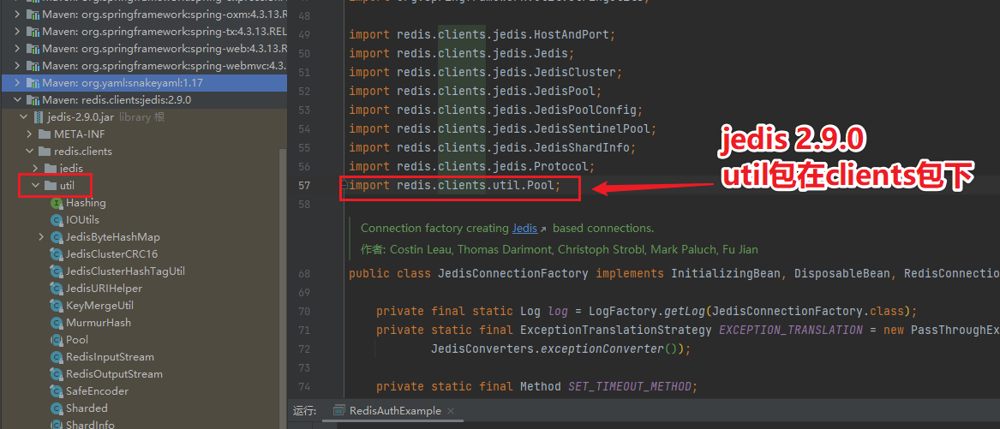
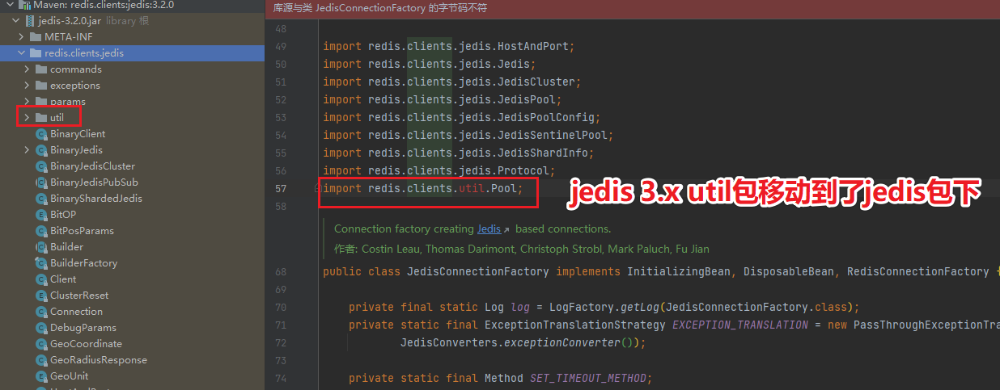

# Springboot1.x使用JedisTemplate工具类访问redis服务（适用于自搭建redis、AWS ElastiCache等服务，支持单节点、集群、加密、SSL传输认证），并可根据环境自动创建集群或单节点模式客户端。

<font size=5>
　　Springboot1.x默认内置jedis作为redis客户端，SpringBoot1.5.x项目如果要访问AWS ElastiCache加密服务则必须要开启SSL传输加密。
</br>
</br>
　　以1.5.9.RELEASE为例：spring-boot-starter-data-redis默认依赖的jedis版本为2.9.0，查询jedis官方Release Notes可以发现早在2016.9.11发布的2.9.0版本就已经开始支持单节点SSL，而直到2019.7.23 3.1.0版本的发布才开始支持集群模式SSL，因此当项目仅需要访问单机版的加密AWS ElastiCache时，可以直接使用2.9.0客户端，如果要使用集群模式的加密AWS ElastiCache则必须要更换到至少3.1.0版本及以上。
</font>
</br>
</br>

### 1、使用前需要关闭Springboot对redis的自动装配。
```java
@SpringBootApplication(exclude = {
        RedisAutoConfiguration.class,
        RedisRepositoriesAutoConfiguration.class
})
public class RedisAuthExample {
    public static void main(String[] args) {
        SpringApplication.run(RedisAuthExample.class, args);
    }
}
```
</br>

### 2、取消spring-boot-starter-data-redis的依赖，更换成spring-data-redis，引入 jedis3.x (推荐3.3.0)。
```java
<!--spring-boot-starter-data-redis-->
<!--<dependency>-->
<!--  <groupId>org.springframework.boot</groupId>-->
<!--  <artifactId>spring-boot-starter-data-redis</artifactId>-->
<!--</dependency>-->

<!-- https://mvnrepository.com/artifact/org.springframework.data/spring-data-redis -->
<dependency>
    <groupId>org.springframework.data</groupId>
    <artifactId>spring-data-redis</artifactId>
</dependency>

<!--jedis-->
<dependency>
    <groupId>redis.clients</groupId>
    <artifactId>jedis</artifactId>
    <version>3.3.0</version>
</dependency>
```
</br>

### 3、application.yml

> 3.1、单节点配置
```java
spring:
  redis:
    database: 0
    cluster:
      #redis客户端名称,jedis、redisson有该属性，lettuce没有
      clientName: 'redis-client-name'
      #Redis服务器访问密码
      password: 123456
      #集群模式下，逗号分隔的键值对（主机：端口）形式的服务器列表
      nodes: 127.0.0.1:6379
      #连接超时，指的是连接一个url的连接等待时间
      connectionTimeout: 1000
      #读取数据超时，指的是连接上一个url，获取response的返回等待时间
      soTimeOut: 1000
      #连接失败重试次数
      maxAttempts: 2
      #集群模式下，集群最大转发的数量
      max-redirects: 3
      #是否启用SSL连接，AWS rds服务要开启SSL才可以正常访问
      ssl: false
      #是否开启集群模式，按环境加载对应的客户端模式
      clusterEnable: false
    pool:
      max-active: 50  # 连接池最大连接数（使用负值表示没有限制）
      max-wait: -1  # 连接池最大阻塞等待时间（使用负值表示没有限制）
      max-idle: 10  # 连接池中的最大空闲连接
      min-idle: 5 # 连接池中的最小空闲连接
```
</br>

> 3.2、集群配置
```java
spring:
  redis:
    database: 0
    cluster:
      #redis客户端名称,jedis、redisson有该属性，lettuce没有
      clientName: 'redis-client-name'
      #Redis服务器访问密码
      password: 123456
      #集群模式下，逗号分隔的键值对（主机：端口）形式的服务器列表
      nodes: 127.0.0.1:6379,127.0.0.1:6380,127.0.0.1:6381,127.0.0.1:6382,127.0.0.1:6383,127.0.0.1:6384
      #连接超时，指的是连接一个url的连接等待时间
      connectionTimeout: 1000
      #读取数据超时，指的是连接上一个url，获取response的返回等待时间
      soTimeOut: 1000
      #连接失败重试次数
      maxAttempts: 2
      #集群模式下，集群最大转发的数量
      max-redirects: 3
      #是否启用SSL连接，AWS rds服务要开启SSL才可以正常访问
      ssl: true
      #是否开启集群模式，按环境加载对应的客户端模式
      clusterEnable: true
    pool:
      max-active: 50  # 连接池最大连接数（使用负值表示没有限制）
      max-wait: -1  # 连接池最大阻塞等待时间（使用负值表示没有限制）
      max-idle: 10  # 连接池中的最大空闲连接
      min-idle: 5 # 连接池中的最小空闲连接
```
</br>

### 4、编写redis属性配置类
```java
@Data
@Configuration
@ConfigurationProperties(prefix = "spring.redis")
public class RedisProperties {

    private Pool pool;

    private Cluster cluster;

    @Getter
    @Setter
    @ToString
    public static class Cluster {
        /**
         * 集群模式下，逗号分隔的键值对（主机：端口）形式的服务器列表
         */
        List<String> nodes;

        /**
         * 连接超时，指的是连接一个url的连接等待时间
         */
        Integer connectionTimeout;

        /**
         * 读取数据超时，指的是连接上一个url，获取response的返回等待时间
         */
        Integer soTimeOut;

        /**
         * 连接失败重试次数
         */
        Integer maxAttempts;

        /**
         * 集群模式下，集群最大转发的数量
         */
        Integer maxRedirects;

        /**
         * jedis客户端名称 3.x版本之后的新参数
         */
        String clientName;

        /**
         * redis访问密码
         */
        String password;

        /**
         * 是否启用SSL连接，AWS rds服务要开启SSL才可以正常访问
         */
        boolean ssl;

        /**
         * 是否开启集群模式，不用环境使用不同的模式
         */
        boolean clusterEnable;
    }

    @Getter
    @Setter
    @ToString
    public static class Pool {

        /**
         * 连接池中的最大空闲连接
         */
        Integer maxIdle;

        /**
         * 连接池中的最小空闲连接
         */
        Integer minIdle;

        /**
         * 连接池最大连接数（使用负值表示没有限制）
         */
        Integer maxActive;

        /**
         * 连接池最大阻塞等待时间（使用负值表示没有限制）
         */
        Integer maxWait;
    }
}
```
</br>
</br>

### 5、新增Condition类，作用是根据配置自动加载对应的jedis客户端模式（单节点+集群）。

> 单节点标识类
```java
public class SingleConditional implements Condition {

    @Override
    public boolean matches(ConditionContext conditionContext, AnnotatedTypeMetadata annotatedTypeMetadata) {
        Environment environment = conditionContext.getEnvironment();
        return !Boolean.parseBoolean(environment.getProperty("spring.redis.cluster.clusterEnable"));
    }
}
```

</br>

> 集群标识类
```java
public class ClusterConditional implements Condition {

    @Override
    public boolean matches(ConditionContext conditionContext, AnnotatedTypeMetadata annotatedTypeMetadata) {
        Environment environment = conditionContext.getEnvironment();
        return Boolean.parseBoolean(environment.getProperty("spring.redis.cluster.clusterEnable"));
    }
}
```
</br>

### 6、手动注册jedisCluster/jedis bean，并封装jedisTemplate工具类操作redis（!!!注意这里不能直接使用JedisConnectionFactory工厂创建jedis链接，因为2.x和3.x代码有些差异，会导致JedisConnectionFactory构建失败，如果访问单节点redis服务，则可以正常使用jedis2.x版本利用JedisConnectionFactory创建链接，访问集群则不行，集群必须要使用jedis3.x）。
> jedis2.x



> jedis3.x


</br>

> JedisCluster客户端(clusterEnable设置true，则代表开启集群模式，注册JedisCluster)
```java
/**
 * 注册JedisCluster bean
 */
@Bean
@Conditional({ClusterConditional.class})
public JedisCluster jedisCluster() {
	log.info("creating jedisCluster bean");
	/**
	 * 配置连接池
	 */
	GenericObjectPoolConfig jedisPoolConfig = new GenericObjectPoolConfig();
	jedisPoolConfig.setMaxWaitMillis(redisProperties.getPool().getMaxWait());
	jedisPoolConfig.setMaxTotal(redisProperties.getPool().getMaxActive());
	jedisPoolConfig.setMaxIdle(redisProperties.getPool().getMaxIdle());
	jedisPoolConfig.setMinIdle(redisProperties.getPool().getMinIdle());

	/**
	 * 配置客户端
	 */
	Set<HostAndPort> jedisClusterNode = new HashSet<>();
	for (String node : redisProperties.getCluster().getNodes()) {
		String[] split = node.split(":");
		jedisClusterNode.add(new HostAndPort(split[0], Integer.valueOf(split[1])));
	}

	/**
	 * jedis客户端3.x版本之前不支持集群SSL链接，连接AWS redis加密资源需要开启SSL，需要换成3.x版本以上
	 * JedisCluster(
	 *      HostAndPort node,
	 *      int connectionTimeout,
	 *      int soTimeout,
	 *      int maxAttempts,
	 *      String password,
	 *      String clientName,
	 *      final GenericObjectPoolConfig poolConfig,
	 *      boolean ssl
	 *      )
	 */
	JedisCluster jedisCluster = new JedisCluster(jedisClusterNode, redisProperties.getCluster().getConnectionTimeout(), redisProperties.getCluster().getSoTimeOut(),
												 redisProperties.getCluster().getMaxAttempts(), redisProperties.getCluster().getPassword(), redisProperties.getCluster().getClientName(),
												 jedisPoolConfig, redisProperties.getCluster().isSsl());
	log.info("creating JedisCluster bean success");
	return jedisCluster;
}
```
</br>

> Jedis客户端(clusterEnable设置false，则代表关闭集群模式，注册jedis单节点客户端)
```java
/**
 * 注册Jedis bean
 * Jedis(final String host, final int port, final int timeout, final boolean ssl)
 */
@Bean
@Conditional({SingleConditional.class})
public Jedis jedis() {
	log.info("creating Single jedis bean");
	String node = redisProperties.getCluster().getNodes().get(0);
	String[] split = node.split(":");
	Jedis jedis = new Jedis(split[0], Integer.valueOf(split[1]), redisProperties.getCluster().getConnectionTimeout(), redisProperties.getCluster().isSsl());
	jedis.auth(redisProperties.getCluster().getPassword());
	log.info("creating Single jedis success");
	return jedis;
}
```
</br>

> 创建Jedis工具类、JedisClusterUtil工具类，且两个工具类均实现IJedisTemplate接口

IJedisTemplate接口
```java
public interface IJedisTemplate {

	...

    /* ------------------------------------- String 相关操作 -------------------------------------------*/

    /**
     * 用于设置给定 key 的值。如果 key 已经存储其他值， SET 就覆写旧值，且无视类型
     */
    public String set(String key, String value);

    /**
     * 用于获取指定 key 的值。如果 key 不存在，返回 nil 。如果key 储存的值不是字符串类型，返回一个错误
     */
    public String get(String key);

    /**
     * 返回所有(一个或多个)给定 key 的值。 如果给定的 key 里面，有某个 key 不存在，那么这个 key 返回特殊值 nil
     */
    public List<String> mget(String... key);

    /**
     * 用于同时设置一个或多个 key-value 对
     *
     * @param keysValues MSET key1 value1 key2 value2 .. keyN valueN
     */
    public String mset(String... keysValues);

    /**
     * 用于所有给定 key 都不存在时，同时设置一个或多个 key-value
     */
    public Long msetnx(String... keysValues);

    /**
     * 用于获取存储在指定 key 中字符串的子字符串。字符串的截取范围由 start 和 end 两个偏移量决定(包括 start 和 end 在内!)
     */
    public String getRange(String key, Long start, Long end);

    /**
     * 为指定的 key 设置值及其过期时间。如果 key 已经存在， SETEX 命令将会替换旧的值和过期时间
     *
     * @param key     指定 key
     * @param seconds 过期时间-秒
     * @param value   值
     */
    public String setex(String key, Integer seconds, String value);

    /**
     * 命令以毫秒 milliseconds 为单位设置 key 的生存时间
     */
    public String psetxx(String key, Long milliseconds, String value);

    /**
     * 在指定的 key 不存在时，为 key 设置指定的值.否则设置无效
     */
    public Long setnx(String key, String value);

    /**
     * 用指定的字符串覆盖给定 key 所储存的字符串值，覆盖的位置从偏移量 offset 开始
     */
    public Long setRange(String key, Long offset, String value);

    /**
     * 用于获取指定 key 所储存的字符串值的长度。当 key 储存的不是字符串值时，返回一个错误
     */
    public Long strlen(String key);

    /**
     * Redis Incr 命令将 key 中储存的数字值增一。
     * !:如果 key 不存在，那么 key 的值会先被初始化为 0 ，然后再执行 INCR 操作。
     * !:如果值包含错误的类型，或字符串类型的值不能表示为数字，那么返回一个错误。
     * !:本操作的值限制在 64 位(bit)有符号数字表示之内。
     */
    public Long incr(String key);

    /**
     * Redis Incr 命令将 key 中储存的数字值减一。
     * !:如果 key 不存在，那么 key 的值会先被初始化为 0 ，然后再执行 INCR 操作。
     * !:如果值包含错误的类型，或字符串类型的值不能表示为数字，那么返回一个错误。
     * !:本操作的值限制在 64 位(bit)有符号数字表示之内。
     */
    public Long decr(String key);

    /**
     * 用于为指定的 key 追加值。
     * :如果 key 已经存在并且是一个字符串， APPEND 命令将 value 追加到 key 原来的值的末尾。
     * :如果 key 不存在， APPEND 就简单地将给定 key 设为 value ，就像执行 SET key value 一样
     */
    public Object append(String key, String value);
	
	...详细请参照项目代码
}
```
</br>

JedisClusterUtil工具类(集群用)
```java
@Slf4j
@Component
@ConditionalOnBean(JedisCluster.class)
public class JedisClusterUtil implements IJedisTemplate {

    @Autowired(required = false)
    private JedisCluster jedisCluster;

	...

    /* ------------------------------------- String 相关操作 -------------------------------------------*/

    /**
     * 用于设置给定 key 的值。如果 key 已经存储其他值， SET 就覆写旧值，且无视类型
     */
    @Override
    public String set(String key, String value) {
        return jedisCluster.set(key, value);
    }

    /**
     * 用于获取指定 key 的值。如果 key 不存在，返回 nil 。如果key 储存的值不是字符串类型，返回一个错误
     */
    @Override
    public String get(String key) {
        return jedisCluster.get(key);
    }

    /**
     * 返回所有(一个或多个)给定 key 的值。 如果给定的 key 里面，有某个 key 不存在，那么这个 key 返回特殊值 nil
     */
    @Override
    public List<String> mget(String... key) {
        return jedisCluster.mget(key);
    }

    /**
     * 用于同时设置一个或多个 key-value 对
     *
     * @param keysValues MSET key1 value1 key2 value2 .. keyN valueN
     */
    @Override
    public String mset(String... keysValues) {
        return jedisCluster.mset(keysValues);
    }

    /**
     * 用于所有给定 key 都不存在时，同时设置一个或多个 key-value
     */
    @Override
    public Long msetnx(String... keysValues) {
        return jedisCluster.msetnx(keysValues);
    }

    /**
     * 用于获取存储在指定 key 中字符串的子字符串。字符串的截取范围由 start 和 end 两个偏移量决定(包括 start 和 end 在内!)
     */
    @Override
    public String getRange(String key, Long start, Long end) {
        return jedisCluster.getrange(key, start, end);
    }

    /**
     * 为指定的 key 设置值及其过期时间。如果 key 已经存在， SETEX 命令将会替换旧的值和过期时间
     *
     * @param key     指定 key
     * @param seconds 过期时间-秒
     * @param value   值
     */
    @Override
    public String setex(String key, Integer seconds, String value) {
        return jedisCluster.setex(key, seconds, value);
    }

    /**
     * 命令以毫秒 milliseconds 为单位设置 key 的生存时间
     */
    @Override
    public String psetxx(String key, Long milliseconds, String value) {
        return jedisCluster.psetex(key, milliseconds, value);
    }

    /**
     * 在指定的 key 不存在时，为 key 设置指定的值.否则设置无效
     */
    @Override
    public Long setnx(String key, String value) {
        return jedisCluster.setnx(key, value);
    }

    /**
     * 用指定的字符串覆盖给定 key 所储存的字符串值，覆盖的位置从偏移量 offset 开始
     */
    @Override
    public Long setRange(String key, Long offset, String value) {
        return jedisCluster.setrange(key, offset, value);
    }

    /**
     * 用于获取指定 key 所储存的字符串值的长度。当 key 储存的不是字符串值时，返回一个错误
     */
    @Override
    public Long strlen(String key) {
        return jedisCluster.strlen(key);
    }

    /**
     * Redis Incr 命令将 key 中储存的数字值增一。
     * !:如果 key 不存在，那么 key 的值会先被初始化为 0 ，然后再执行 INCR 操作。
     * !:如果值包含错误的类型，或字符串类型的值不能表示为数字，那么返回一个错误。
     * !:本操作的值限制在 64 位(bit)有符号数字表示之内。
     */
    @Override
    public Long incr(String key) {
        return jedisCluster.incr(key);
    }

    /**
     * Redis Incr 命令将 key 中储存的数字值减一。
     * !:如果 key 不存在，那么 key 的值会先被初始化为 0 ，然后再执行 INCR 操作。
     * !:如果值包含错误的类型，或字符串类型的值不能表示为数字，那么返回一个错误。
     * !:本操作的值限制在 64 位(bit)有符号数字表示之内。
     */
    @Override
    public Long decr(String key) {
        return jedisCluster.decr(key);
    }

    /**
     * 用于为指定的 key 追加值。
     * :如果 key 已经存在并且是一个字符串， APPEND 命令将 value 追加到 key 原来的值的末尾。
     * :如果 key 不存在， APPEND 就简单地将给定 key 设为 value ，就像执行 SET key value 一样
     */
    @Override
    public Object append(String key, String value) {
        return jedisCluster.append(key, value);
    }
	
	...详细请参照项目代码
}
```
</br>

Jedis工具类（单节点用）
```java
@Slf4j
@Component
@ConditionalOnBean(Jedis.class)
public class JedisUtil {

    @Autowired(required = false)
    private Jedis jedis;
	
	...

    /**
     * 用于设置给定 key 的值。如果 key 已经存储其他值， SET 就覆写旧值，且无视类型
     */
    public String set(String key, String value) {
        return jedis.set(key, value);
    }

    /**
     * 用于获取指定 key 的值。如果 key 不存在，返回 nil 。如果key 储存的值不是字符串类型，返回一个错误
     */
    public String get(String key) {
        return jedis.get(key);
    }

    /**
     * 返回所有(一个或多个)给定 key 的值。 如果给定的 key 里面，有某个 key 不存在，那么这个 key 返回特殊值 nil
     */
    public List<String> mget(String... key) {
        return jedis.mget(key);
    }

    /**
     * 用于同时设置一个或多个 key-value 对
     *
     * @param keysValues MSET key1 value1 key2 value2 .. keyN valueN
     */
    public String mset(String... keysValues) {
        return jedis.mset(keysValues);
    }

    /**
     * 用于所有给定 key 都不存在时，同时设置一个或多个 key-value
     */
    public Long msetnx(String... keysValues) {
        return jedis.msetnx(keysValues);
    }

    /**
     * 用于获取存储在指定 key 中字符串的子字符串。字符串的截取范围由 start 和 end 两个偏移量决定(包括 start 和 end 在内!)
     */
    public String getRange(String key, Long start, Long end) {
        return jedis.getrange(key, start, end);
    }

    /**
     * 为指定的 key 设置值及其过期时间。如果 key 已经存在， SETEX 命令将会替换旧的值和过期时间
     *
     * @param key     指定 key
     * @param seconds 过期时间-秒
     * @param value   值
     */
    public String setex(String key, Integer seconds, String value) {
        return jedis.setex(key, seconds, value);
    }

    /**
     * 命令以毫秒 milliseconds 为单位设置 key 的生存时间
     */
    public String psetxx(String key, Long milliseconds, String value) {
        return jedis.psetex(key, milliseconds, value);
    }

    /**
     * 在指定的 key 不存在时，为 key 设置指定的值.否则设置无效
     */
    public Long setnx(String key, String value) {
        return jedis.setnx(key, value);
    }

    /**
     * 用指定的字符串覆盖给定 key 所储存的字符串值，覆盖的位置从偏移量 offset 开始
     */
    public Long setRange(String key, Long offset, String value) {
        return jedis.setrange(key, offset, value);
    }

    /**
     * 用于获取指定 key 所储存的字符串值的长度。当 key 储存的不是字符串值时，返回一个错误
     */
    public Long strlen(String key) {
        return jedis.strlen(key);
    }

    /**
     * Redis Incr 命令将 key 中储存的数字值增一。
     * !:如果 key 不存在，那么 key 的值会先被初始化为 0 ，然后再执行 INCR 操作。
     * !:如果值包含错误的类型，或字符串类型的值不能表示为数字，那么返回一个错误。
     * !:本操作的值限制在 64 位(bit)有符号数字表示之内。
     */
    public Long incr(String key) {
        return jedis.incr(key);
    }

    /**
     * Redis Incr 命令将 key 中储存的数字值减一。
     * !:如果 key 不存在，那么 key 的值会先被初始化为 0 ，然后再执行 INCR 操作。
     * !:如果值包含错误的类型，或字符串类型的值不能表示为数字，那么返回一个错误。
     * !:本操作的值限制在 64 位(bit)有符号数字表示之内。
     */
    public Long decr(String key) {
        return jedis.decr(key);
    }

    /**
     * 用于为指定的 key 追加值。
     * :如果 key 已经存在并且是一个字符串， APPEND 命令将 value 追加到 key 原来的值的末尾。
     * :如果 key 不存在， APPEND 就简单地将给定 key 设为 value ，就像执行 SET key value 一样
     */
    public Object append(String key, String value) {
        return jedis.append(key, value);
    }
	
	...详细请参照项目代码
}
```
</br>

### 7、[测试](http://localhost:8080/jedisTemplate/set/jedisTemplateKey/jedisTemplateValue)
```java
@RestController
@RequestMapping("/jedisTemplate")
public class JedisTemplateController {
    
    @Autowired
    IJedisTemplate jedisTemplate;

    /**
     * @param key
     * @return
     */
    @GetMapping("/get/{key}")
    public String getKey(@PathVariable String key) {
        return jedisTemplate.get(key);
    }

    /**
     * @param key
     * @param value
     * @return
     */
    @GetMapping("/set/{key}/{value}")
    public String setKey(@PathVariable String key, @PathVariable String value) {
        jedisTemplate.set(key, value);
        return jedisTemplate.get(key);
    }
}
```