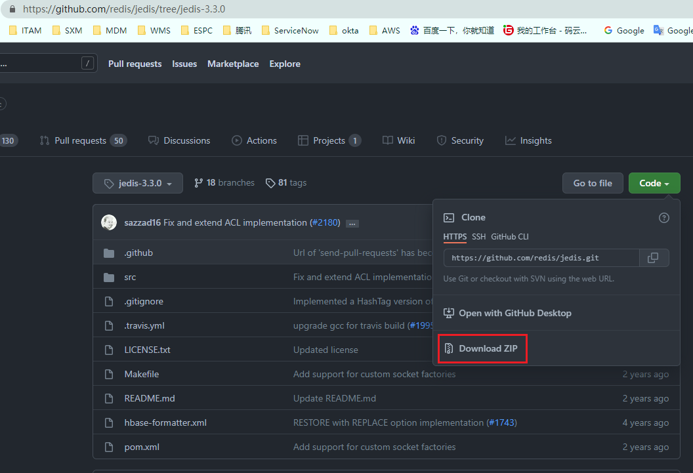
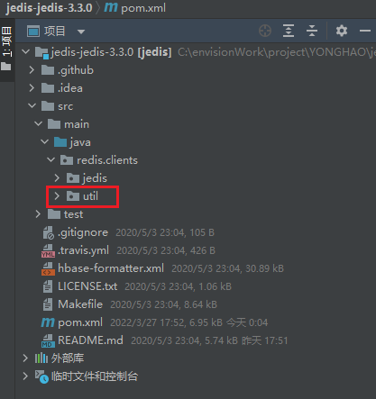
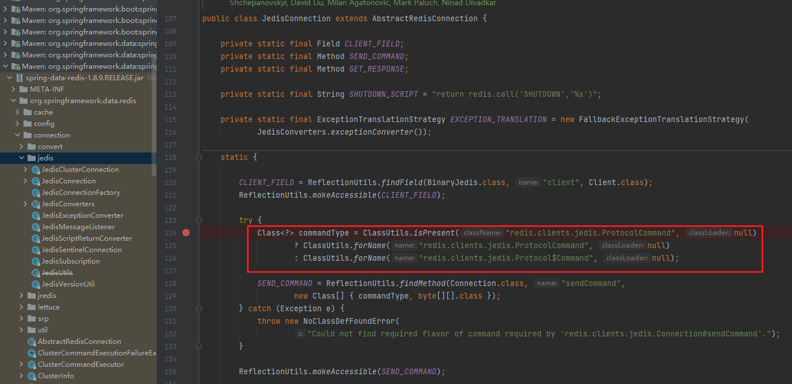
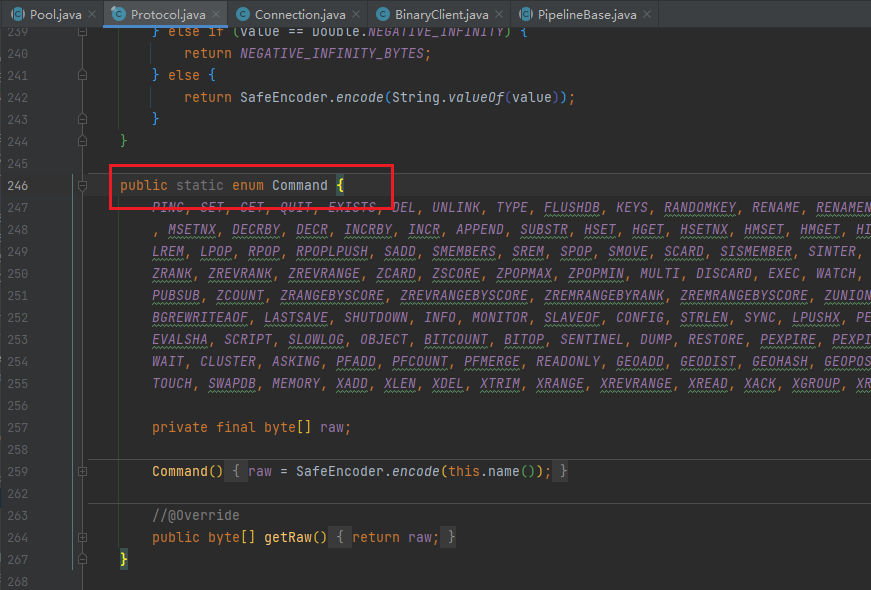

# Springboot1.x使用jedis + Spring Data Redis创建JedisConnectionFactory构造RedisTemplate访问redis服务（适用于自搭建redis、AWS ElastiCache等服务，支持单节点、集群、加密、SSL传输认证），并可根据环境自动创建集群或单节点模式客户端。

<font size=5>
　　以1.5.9.RELEASE为例，其默认依赖的spring-data-redis版本为1.8.9.RELEASE，jedis为2.9.0，而jedis3.x和2.x代码差异较大，因此spring-data-redis默认不能正常使用jedis3.x，因此不能正常创建JedisConnectionFactory工厂，所以就需要涉及jedis的部分源码改造。
</font>
</br>
</br>

### 1、下载jedis3.3.0源码并修改，也可使用resources/lib下我已打包好的jedis-3.3.1（非官方版本，主要对Spring Data Redis1.8.9作了适配）
> 1.1、下载jedis3.3.0源码并地导入IDE开发工具【 [jedis-3.3.0](https://github.com/redis/jedis/tree/jedis-3.3.0)】



>  1.2、利用IDE开发工具进行代码重构，将util包从jedis包下移到clients包下，修复spring-data-redis 1.8.9下导入jedis异常问题。


</br>



>  1.3、将redis.clients.jedis.Protocol下的内部枚举Command取消实现ProtocolCommand接口，并修改项目中所有使用sendCommand()方法相关的ProtocolCommand参数为Protocol.Command（找不到时可根据ide工具提示或直接打包编译，出错时再反查并找到修复即可）,目的是为了修复在创建JedisConnection时，由于ProtocolCommand是一个接口，不能被实例化，因此系统在匹配Protocol类中的SEND_COMMAND方法时，会使用老jedis包中的redis.clients.jedis.Protocol$Command来作匹配，而jedis3.x中Command枚举实现了ProtocolCommand接口，因此导致始终匹配不上，调用redis命令失败。





>  1.4、打包并上传到私服或直接引用本地包。

</br>

### 2、取消spring-boot-starter-data-redis的依赖，更换成spring-data-redis，引入本地重新打包好或已经安装至私服的jedis3.3.1。
```java
<!--spring-boot-starter-data-redis-->
<!--<dependency>-->
<!--  <groupId>org.springframework.boot</groupId>-->
<!--  <artifactId>spring-boot-starter-data-redis</artifactId>-->
<!--</dependency>-->

<!-- https://mvnrepository.com/artifact/org.springframework.data/spring-data-redis -->
<dependency>
    <groupId>org.springframework.data</groupId>
    <artifactId>spring-data-redis</artifactId>
</dependency>

<!--jedis重新打包过的新版本-->
<dependency>
    <groupId>redis.clients</groupId>
    <artifactId>jedis</artifactId>
    <version>3.3.1</version>
</dependency>
```
</br>

### 3、application.yml

> 3.1、单节点配置
```java
spring:
  redis:
    database: 0
    cluster:
      #redis客户端名称,jedis、redisson有该属性，lettuce没有
      clientName: 'redis-client-name'
      #Redis服务器访问密码
      password: 123456abcd
      #集群模式下，逗号分隔的键值对（主机：端口）形式的服务器列表
      nodes: 127.0.0.1:6379
      #连接超时，指的是连接一个url的连接等待时间
      connectionTimeout: 1000
      #读取数据超时，指的是连接上一个url，获取response的返回等待时间
      soTimeOut: 1000
      #连接失败重试次数
      maxAttempts: 2
      #集群模式下，集群最大转发的数量
      max-redirects: 3
      #是否启用SSL连接，AWS rds服务要开启SSL才可以正常访问
      ssl: false
      #是否开启集群模式，按环境加载对应的客户端模式
      clusterEnable: false
    pool:
      max-active: 50  # 连接池最大连接数（使用负值表示没有限制）
      max-wait: -1  # 连接池最大阻塞等待时间（使用负值表示没有限制）
      max-idle: 10  # 连接池中的最大空闲连接
      min-idle: 5 # 连接池中的最小空闲连接
```
</br>

> 3.2、集群配置
```java
spring:
  redis:
    database: 0
    cluster:
      #redis客户端名称,jedis、redisson有该属性，lettuce没有
      clientName: 'redis-client-name'
      #Redis服务器访问密码
      password: 123456
      #集群模式下，逗号分隔的键值对（主机：端口）形式的服务器列表
      nodes: 127.0.0.1:6379,127.0.0.1:6380,127.0.0.1:6381,127.0.0.1:6382,127.0.0.1:6383,127.0.0.1:6384
      #连接超时，指的是连接一个url的连接等待时间
      connectionTimeout: 1000
      #读取数据超时，指的是连接上一个url，获取response的返回等待时间
      soTimeOut: 1000
      #连接失败重试次数
      maxAttempts: 2
      #集群模式下，集群最大转发的数量
      max-redirects: 3
      #是否启用SSL连接，AWS rds服务要开启SSL才可以正常访问
      ssl: true
      #是否开启集群模式，按环境加载对应的客户端模式
      clusterEnable: true
    pool:
      max-active: 50  # 连接池最大连接数（使用负值表示没有限制）
      max-wait: -1  # 连接池最大阻塞等待时间（使用负值表示没有限制）
      max-idle: 10  # 连接池中的最大空闲连接
      min-idle: 5 # 连接池中的最小空闲连接
```
</br>

### 4、新建JedisConnectionFactorySub类继承JedisConnectionFactory，并重写createCluster方法，修复集群模式下无法创建JedisCluster。
```java
public class JedisConnectionFactorySub extends JedisConnectionFactory implements ApplicationContextAware {

    protected RedisProperties redisProperties;

    public JedisConnectionFactorySub(RedisClusterConfiguration redisClusterConfiguration, JedisPoolConfig jedisPoolConfig) {
        super(redisClusterConfiguration, jedisPoolConfig);
    }

    @Override
    public void setApplicationContext(ApplicationContext applicationContext) throws BeansException {
        this.redisProperties = (RedisProperties) applicationContext.getBean("redisProperties");
    }

    /**
     * 修复JedisConnectionFactory原生的createCluster创建JedisCluster客户端失败问题
     *
     * @param clusterConfig
     * @param poolConfig
     * @return
     */
    @Override
    protected JedisCluster createCluster(RedisClusterConfiguration clusterConfig, GenericObjectPoolConfig poolConfig) {
        Assert.notNull(clusterConfig, "Cluster configuration must not be null!");
        Set<HostAndPort> hostAndPort = new HashSet<HostAndPort>();
        for (RedisNode node : clusterConfig.getClusterNodes()) {
            hostAndPort.add(new HostAndPort(node.getHost(), node.getPort()));
        }
        return new JedisCluster(hostAndPort, redisProperties.getCluster().getConnectionTimeout(), redisProperties.getCluster().getSoTimeOut(), redisProperties.getCluster().getMaxAttempts(),
                                redisProperties.getCluster().getPassword(), redisProperties.getCluster().getClientName(), poolConfig, redisProperties.getCluster().isSsl());
    }
}
```
</br>

### 5、注册 RedisTemplate/StringRedisTemplate Bean，根据clusterEnable设置注册集群或单节点jedis客户端，并封装工具类操作redis。
```java
/**
 * 注册JedisConnectionFactory
 */
@Bean
public JedisConnectionFactory jedisConnectionFactory() {
	log.info("creating JedisConnectionFactory");
	JedisPoolConfig jedisPoolConfig = new JedisPoolConfig();
	jedisPoolConfig.setMaxWaitMillis(redisProperties.getPool().getMaxWait());
	jedisPoolConfig.setMaxTotal(redisProperties.getPool().getMaxActive());
	jedisPoolConfig.setMaxIdle(redisProperties.getPool().getMaxIdle());
	jedisPoolConfig.setMinIdle(redisProperties.getPool().getMinIdle());

	JedisConnectionFactory jedisConnectionFactory;
	if (redisProperties.getCluster().isClusterEnable()) {
		log.info("creating cluster JedisConnectionFactory");
		//创建redis集群连接工厂
		jedisConnectionFactory = new JedisConnectionFactorySub(new RedisClusterConfiguration(redisProperties.getCluster().getNodes()), jedisPoolConfig);
	} else {
		log.info("creating single JedisConnectionFactory");
		//创建redis单机版连接工厂
		String node = redisProperties.getCluster().getNodes().get(0);
		String[] split = node.split(":");
		jedisConnectionFactory = new JedisConnectionFactory(jedisPoolConfig);
		jedisConnectionFactory.setHostName(split[0]);
		jedisConnectionFactory.setPort(Integer.valueOf(split[1]));
	}

	jedisConnectionFactory.setPassword(redisProperties.getCluster().getPassword());
	jedisConnectionFactory.setClientName(redisProperties.getCluster().getClientName());
	jedisConnectionFactory.setUseSsl(redisProperties.getCluster().isSsl());
	log.info("creating JedisConnectionFactory success {}", jedisConnectionFactory);
	return jedisConnectionFactory;
}

/**
 * 注册StringRedisTemplate
 * key 和 value 都为String类型
 * 都使用Jackson2JsonRedisSerializer进行序列化
 */
@Bean
public StringRedisTemplate stringRedisTemplateJedis(JedisConnectionFactory jedisConnectionFactory) {
	log.info("creating stringRedisTemplateJedis bean by Jedis:[{}]", jedisConnectionFactory);
	return new StringRedisTemplate(jedisConnectionFactory);
}

/**
 * 注册RedisTemplate
 * key 为String类型
 * value 为 Object 类型
 * 都使用Jackson2JsonRedisSerializer进行序列化
 */
@Bean
public RedisTemplate<String, Object> redisTemplateJedis(JedisConnectionFactory jedisConnectionFactory) {
	log.info("creating redisTemplateJedis bean by Jedis:[{}]", jedisConnectionFactory);
	RedisTemplate<String, Object> template = new RedisTemplate<>();
	template.setConnectionFactory(jedisConnectionFactory);
	Jackson2JsonRedisSerializer jackson2JsonRedisSerializer = new Jackson2JsonRedisSerializer(Object.class);
	ObjectMapper om = new ObjectMapper();
	om.setVisibility(PropertyAccessor.ALL, JsonAutoDetect.Visibility.ANY);
	om.enableDefaultTyping(ObjectMapper.DefaultTyping.NON_FINAL);
	jackson2JsonRedisSerializer.setObjectMapper(om);
	StringRedisSerializer stringRedisSerializer = new StringRedisSerializer();
	// key采用String的序列化方式
	template.setKeySerializer(stringRedisSerializer);
	// hash的key也采用String的序列化方式
	template.setHashKeySerializer(stringRedisSerializer);
	// value序列化方式采用jackson
	template.setValueSerializer(jackson2JsonRedisSerializer);
	// hash的value序列化方式采用jackson
	template.setHashValueSerializer(jackson2JsonRedisSerializer);
	template.afterPropertiesSet();
	return template;
}
```
</br>

### 6、测试
> [redisTemplate测试](http://localhost:8080/jedis/redisTemplate/set/jedisRedisTemplateKey/jedisRedisTemplateValue)

```java
@RestController
@RequestMapping("/jedis/redisTemplate")
public class RedisTemplateJedisTest {

    @Autowired
    private RedisTemplateJedisUtil redisTemplate;

    /**
     * @param key
     * @return
     */
    @GetMapping("/get/{key}")
    public String getKey(@PathVariable String key) {
        return (String) redisTemplate.get(key);
    }

    /**
     * @param key
     * @param value
     * @return
     */
    @GetMapping("/set/{key}/{value}")
    public String setKey(@PathVariable String key, @PathVariable String value) {
        redisTemplate.set(key, value);
        return (String) redisTemplate.get(key);
    }
	
	...
}
```
</br>

> [stringRedisTemplate测试](http://localhost:8080/jedis/string/set/jedisStringRedisTemplateKey/jedisStringRedisTemplateValue)

```java
@RestController
@RequestMapping("/jedis/string")
public class StringRedisTemplateJedisTest {

    @Autowired
    private StringRedisTemplateJedisUtil stringRedisTemplate;

    @GetMapping("/get/{key}")
    public String getKeyByLettuce(@PathVariable String key) {
        //根据key获取缓存中的val
        return stringRedisTemplate.get(key);
    }

    @GetMapping("/set/{key}/{value}")
    public String setKeyByLettuce(@PathVariable String key, @PathVariable String value) {
        stringRedisTemplate.set(key, value);
        return stringRedisTemplate.get(key);
    }
}
```