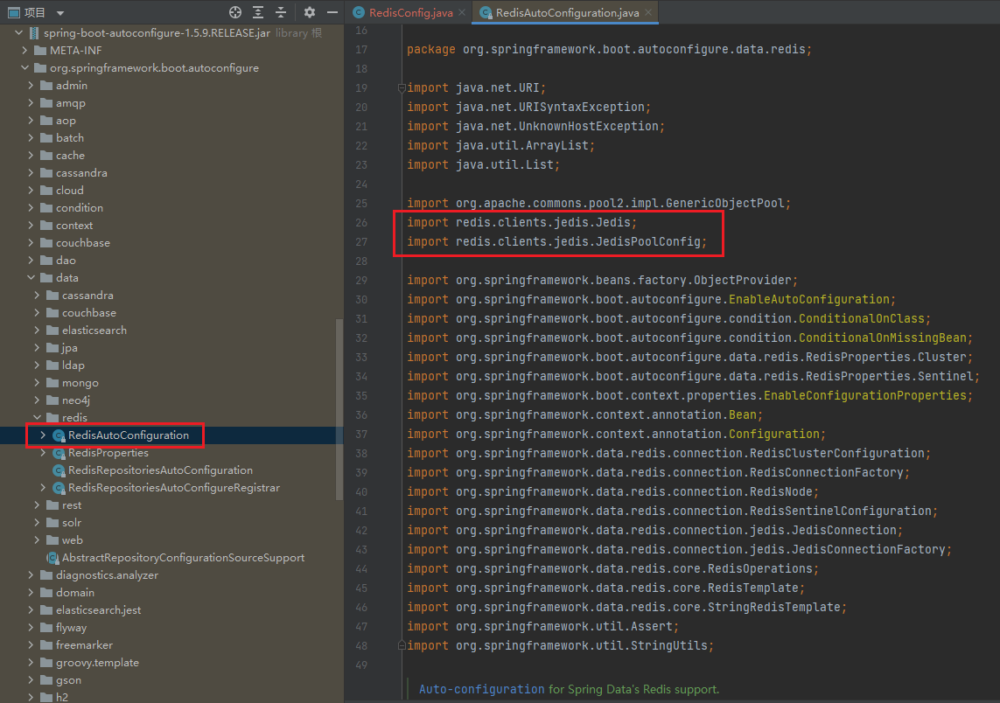

# Springboot1.x使用Lettuce访问redis服务（适用于自搭建redis、AWS ElastiCache等服务，支持单节点、集群、加密、SSL传输认证），并可根据环境自动创建集群或单节点模式客户端。

### 1、由于springboot1.x默认内置jedis作为redis客户端，spring-boot-autoconfigure默认只对jedis实现了自动装配，因此springboot1.x项目中要使用lettuce客户端，需要手动注册LettuceConnectionFactory bean来实现注册RedisTemplate。

</br>

### 2、取消spring-boot-starter-data-redis的依赖，更换成spring-data-redis(目的是避免系统自动依赖jedis包)，由于springboot版本为1.5.9,自动依赖的spring Data Redis版本为1.8.9.RELEASE，在创建LettuceConnectionFactory工厂bean时，需要依赖com.lambdaworks.redis.*组件，而com.lambdaworks仅在低版本的lettuce中才有，所以不支持5.x及以上的高版本lettuce，因此只能使用4.5.X及以下版本(lettuce5.x以上版本与4及以下版本相差较大，代码结构变化较大，甚至组织信息也发生了改变)。


在pom.xml中添加或更新依赖
```java
<!--spring-boot-starter-data-redis-->
<!--<dependency>-->
<!--  <groupId>org.springframework.boot</groupId>-->
<!--  <artifactId>spring-boot-starter-data-redis</artifactId>-->
<!--</dependency>-->

<!-- https://mvnrepository.com/artifact/org.springframework.data/spring-data-redis -->
<dependency>
    <groupId>org.springframework.data</groupId>
    <artifactId>spring-data-redis</artifactId>
</dependency>


<!-- 4.5.x 版本及以下 groupId：biz.paluch.redis -->
<!-- 5.x 版本及以下 groupId：io.lettuce -->
<dependency>
    <groupId>biz.paluch.redis</groupId>
    <artifactId>lettuce</artifactId>
    <version>4.5.0.Final</version>
</dependency>
```
</br>

### 3、application.yml

> 3.1、单节点配置
```java
spring:
  redis:
    database: 0
    cluster:
      #redis客户端名称,jedis、redisson有该属性，lettuce没有
      clientName: 'redis-client-name'
      #Redis服务器访问密码
      password: 123456
      #集群模式下，逗号分隔的键值对（主机：端口）形式的服务器列表
      nodes: 127.0.0.1:6379
      #连接超时，指的是连接一个url的连接等待时间
      connectionTimeout: 1000
      #读取数据超时，指的是连接上一个url，获取response的返回等待时间
      soTimeOut: 1000
      #连接失败重试次数
      maxAttempts: 2
      #集群模式下，集群最大转发的数量
      max-redirects: 3
      #是否启用SSL连接，AWS rds服务要开启SSL才可以正常访问
      ssl: false
      #是否开启集群模式，按环境加载对应的客户端模式
      clusterEnable: false
    pool:
      max-active: 50  # 连接池最大连接数（使用负值表示没有限制）
      max-wait: -1  # 连接池最大阻塞等待时间（使用负值表示没有限制）
      max-idle: 10  # 连接池中的最大空闲连接
      min-idle: 5 # 连接池中的最小空闲连接
```
</br>

> 3.2、集群配置
```java
spring:
  redis:
    database: 0
    cluster:
      #redis客户端名称,jedis、redisson有该属性，lettuce没有
      clientName: 'redis-client-name'
      #Redis服务器访问密码
      password: 123456
      #集群模式下，逗号分隔的键值对（主机：端口）形式的服务器列表
      nodes: xxxxxx:6379
      #连接超时，指的是连接一个url的连接等待时间
      connectionTimeout: 1000
      #读取数据超时，指的是连接上一个url，获取response的返回等待时间
      soTimeOut: 1000
      #连接失败重试次数
      maxAttempts: 2
      #集群模式下，集群最大转发的数量
      max-redirects: 3
      #是否启用SSL连接，AWS rds服务要开启SSL才可以正常访问
      ssl: true
      #是否开启集群模式，按环境加载对应的客户端模式
      clusterEnable: true
    pool:
      max-active: 50  # 连接池最大连接数（使用负值表示没有限制）
      max-wait: -1  # 连接池最大阻塞等待时间（使用负值表示没有限制）
      max-idle: 10  # 连接池中的最大空闲连接
      min-idle: 5 # 连接池中的最小空闲连接
```
</br>

### 4、编写redis属性配置类
```java
@Data
@Configuration
@ConfigurationProperties(prefix = "spring.redis")
public class RedisProperties {

    private Pool pool;

    private Cluster cluster;

    @Getter
    @Setter
    @ToString
    public static class Cluster {
        /**
         * 集群模式下，逗号分隔的键值对（主机：端口）形式的服务器列表
         */
        List<String> nodes;

        /**
         * 连接超时，指的是连接一个url的连接等待时间
         */
        Integer connectionTimeout;

        /**
         * 读取数据超时，指的是连接上一个url，获取response的返回等待时间
         */
        Integer soTimeOut;

        /**
         * 连接失败重试次数
         */
        Integer maxAttempts;

        /**
         * 集群模式下，集群最大转发的数量
         */
        Integer maxRedirects;

        /**
         * jedis客户端名称 3.x版本之后的新参数
         */
        String clientName;

        /**
         * redis访问密码
         */
        String password;

        /**
         * 是否启用SSL连接，AWS rds服务要开启SSL才可以正常访问
         */
        boolean ssl;

        /**
         * 是否开启集群模式，不用环境使用不同的模式
         */
        boolean clusterEnable;
    }

    @Getter
    @Setter
    @ToString
    public static class Pool {

        /**
         * 连接池中的最大空闲连接
         */
        Integer maxIdle;

        /**
         * 连接池中的最小空闲连接
         */
        Integer minIdle;

        /**
         * 连接池最大连接数（使用负值表示没有限制）
         */
        Integer maxActive;

        /**
         * 连接池最大阻塞等待时间（使用负值表示没有限制）
         */
        Integer maxWait;
    }
}
```
</br>

### 5、注册 RedisTemplate/StringRedisTemplate Bean，根据clusterEnable设置注册集群或单节点lettuce客户端，并封装工具类操作redis。
```java
/**
 * 注册LettuceConnectionFactory
 *
 * @return
 */
@Bean
public LettuceConnectionFactory lettuceConnectionFactory() {
	log.info("creating LettuceConnectionFactory");

	/**
	 * Spring Data Redis1.8.9 + lettuce 4.5.0.Final暂时不能使用连接池
	 */
	GenericObjectPoolConfig lettucePoolConfig = new GenericObjectPoolConfig();
	lettucePoolConfig.setMaxWaitMillis(redisProperties.getPool().getMaxWait());
	lettucePoolConfig.setMaxTotal(redisProperties.getPool().getMaxActive());
	lettucePoolConfig.setMaxIdle(redisProperties.getPool().getMaxIdle());
	lettucePoolConfig.setMinIdle(redisProperties.getPool().getMinIdle());
	DefaultLettucePool lettucePool = new DefaultLettucePool();
	lettucePool.setPoolConfig(lettucePoolConfig);

	LettuceConnectionFactory lettuceConnectionFactory;

	if (redisProperties.getCluster().isClusterEnable()) {
		log.info("creating cluster LettuceConnectionFactory");
		//创建redis集群连接工厂
		lettuceConnectionFactory = new LettuceConnectionFactory(new RedisClusterConfiguration(redisProperties.getCluster().getNodes()));
	} else {
		log.info("creating single LettuceConnectionFactory");
		//创建redis单机版连接工厂
		String node = redisProperties.getCluster().getNodes().get(0);
		String[] split = node.split(":");
		lettuceConnectionFactory = new LettuceConnectionFactory();
		lettuceConnectionFactory.setHostName(split[0]);
		lettuceConnectionFactory.setPort(Integer.valueOf(split[1]));
	}

	lettuceConnectionFactory.setPassword(redisProperties.getCluster().getPassword());
	lettuceConnectionFactory.setUseSsl(redisProperties.getCluster().isSsl());
	log.info("creating LettuceConnectionFactory success {}", lettuceConnectionFactory);
	return lettuceConnectionFactory;
}


/**
 * 注册StringRedisTemplate
 *
 * @param lettuceConnectionFactory
 * @return
 */
@Bean
public StringRedisTemplate stringRedisTemplateLettuce(LettuceConnectionFactory lettuceConnectionFactory) {
	log.info("creating stringRedisTemplateLettuce bean by Lettuce:[{}]", lettuceConnectionFactory);
	StringRedisTemplate template = new StringRedisTemplate();
	//注入Lettuce连接工厂
	template.setConnectionFactory(lettuceConnectionFactory);
	return template;
}

/**
 * 注册RedisTemplate
 *
 * @param lettuceConnectionFactory
 * @return
 */
@Bean
public RedisTemplate<String, Object> redisTemplateLettuce(LettuceConnectionFactory lettuceConnectionFactory) {
	log.info("creating redisTemplateLettuce bean by Lettuce:[{}]", lettuceConnectionFactory);
	RedisTemplate<String, Object> template = new RedisTemplate<String, Object>();
	template.setConnectionFactory(lettuceConnectionFactory);
	Jackson2JsonRedisSerializer jackson2JsonRedisSerializer = new Jackson2JsonRedisSerializer(Object.class);
	ObjectMapper om = new ObjectMapper();
	om.setVisibility(PropertyAccessor.ALL, JsonAutoDetect.Visibility.ANY);
	om.enableDefaultTyping(ObjectMapper.DefaultTyping.NON_FINAL);
	jackson2JsonRedisSerializer.setObjectMapper(om);
	StringRedisSerializer stringRedisSerializer = new StringRedisSerializer();

	// key采用String的序列化方式
	template.setKeySerializer(stringRedisSerializer);
	// hash的key也采用String的序列化方式
	template.setHashKeySerializer(stringRedisSerializer);
	// value序列化方式采用jackson
	template.setValueSerializer(jackson2JsonRedisSerializer);
	// hash的value序列化方式采用jackson
	template.setHashValueSerializer(jackson2JsonRedisSerializer);
	template.afterPropertiesSet();
	return template;
}
```
</br>

### 6、测试
> [redisTemplate测试](http://localhost:8080/lettuce/redisTemplate/set/lettuceRedisTemplateKey/lettuceRedisTemplateValue)

```java
@RestController
@RequestMapping("/lettuce/redisTemplate")
public class RedisTemplateLettuceTest {

    /**
     * 使用lettuce客户端集群模式-RedisTemplateLettuceUtil访问redis服务
     */
    @Autowired
    private RedisTemplateLettuceUtil redisTemplate;

    /**
     * @param key
     * @return
     */
    @GetMapping("/get/{key}")
    public String getKey(@PathVariable String key) {
        return (String) redisTemplate.get(key);
    }

    /**
     * @param key
     * @param value
     * @return
     */
    @GetMapping("/set/{key}/{value}")
    public String setKey(@PathVariable String key, @PathVariable String value) {
        redisTemplate.set(key, value);
        return (String) redisTemplate.get(key);
    }
	
	...
}
```
</br>

> [stringRedisTemplate测试](http://localhost:8080/lettuce/string/set/lettuceStringKey/lettuceStringValue) 

```java
@RestController
@RequestMapping("/lettuce/string")
public class StringRedisTemplateLettuceTest {

    @Autowired
    private StringRedisTemplateLettuceUtil stringRedisTemplate;

    @GetMapping("/get/{key}")
    public String getKeyByLettuce(@PathVariable String key) {
        //根据key获取缓存中的val
        return stringRedisTemplate.get(key);
    }

    @GetMapping("/set/{key}/{value}")
    public String setKeyByLettuce(@PathVariable String key, @PathVariable String value) {
        stringRedisTemplate.set(key, value);
        return stringRedisTemplate.get(key);
    }
}
```